# Виджеты в `pybotx`: полное руководство

Этот документ является полной справкой по подсистеме виджетов в `pybotx`.
В нем описано:

- все готовые виджеты из `pybotx.widgets`
- модель выполнения: `WidgetRunner`, `RunnerHookResult`, `@widget_command`
- фабрики хуков: `on_data_key`, `on_completed`, `on_action`
- как писать собственные виджеты
- практические паттерны и рекомендации по тестированию

## 1. Быстрый старт

Минимальная команда с виджетом и автоматическим раннером:

```python
from pybotx import Bot, HandlerCollector, IncomingMessage
from pybotx.widgets import ConfirmWidget, on_action, widget_command
from pybotx.widgets.confirm import CANCEL_ACTION, CONFIRM_ACTION

collector = HandlerCollector()


@collector.command("/confirm-demo", description="Confirm widget demo")
@widget_command(
    before=on_action(
        lambda widget: ConfirmWidget.get_action(widget.message),
        {
            CONFIRM_ACTION: "Confirmed",
            CANCEL_ACTION: "Cancelled",
        },
    ),
)
async def confirm_demo_handler(message: IncomingMessage, bot: Bot) -> ConfirmWidget:
    return ConfirmWidget(
        label="Confirm deployment?",
        message=message,
        bot=bot,
        command="/confirm-demo",
    )
```

Что происходит:

1. хендлер создает и возвращает виджет
2. `@widget_command` оборачивает хендлер и запускает `WidgetRunner`
3. хук `before` обрабатывает нажатие кнопки и отправляет результат
4. если callback-данных нет, отображается сам виджет

## 2. Архитектура и жизненный цикл

### 2.1 Базовый класс `Widget`

Каждый виджет:

- получает `message`, `bot`, `command`
- создает `widget_message` (`OutgoingMessage`)
- заполняет `widget_message.body`
- добавляет bubbles/keyboard в `add_markup()`
- отображается через `display()`

Обязательный метод:

- `add_markup(self) -> None` (абстрактный)

Полезные методы:

- `display()`: `add_markup()` + `send_widget_message()`
- `send_result(body, markup=None)`: отправляет результат как edit или как новое сообщение
- `send_or_update_message(widget_message)`: внутренняя логика send/edit
- `add_additional_markup()`: объединяет внешний `MessageMarkup`

### 2.2 Семантика отправки/редактирования

Служебные метаданные:

- сообщения виджетов содержат `pybotx_widget = 1` в metadata
- ключ режима результата: `pybotx_widget_result_mode`

Поведение display/update:

- если входящее сообщение имеет `pybotx_widget=1` и `source_sync_id`, виджет пытается редактировать предыдущее сообщение
- иначе виджет отправляет новое сообщение

### 2.3 Режим результата (`edit` vs `message`)

- `WIDGET_RESULT_MODE_EDIT = "edit"`
- `WIDGET_RESULT_MODE_MESSAGE = "message"`

Приоритет выбора режима в `Widget._resolve_result_mode()`:

1. явный `result_mode`, переданный в конструктор виджета
2. режим из входящей metadata (`pybotx_widget_result_mode`)
3. режим из аргумента команды:
   `edit|inline|update` -> `edit`,
   `message|reply|send` -> `message`,
   также поддерживаются `mode=...`, `result=...`, `--mode=...`, `--result=...`
4. значение по умолчанию: `edit`

## 3. API раннера

### 3.1 `RunnerHookResult`

`RunnerHookResult` управляет потоком выполнения в `before`-хуке:

- `result: str | None` -> если задан, отправляется текст результата
- `should_display: bool` -> если `False`, после хука виджет не отображается
- `widget: Widget | None` -> замена текущего виджета (например, после пересборки состояния)

### 3.2 `WidgetRunner`

`WidgetRunner.run(widget, before=None, after=None)`:

- запускает `before(widget)`, если он задан
- применяет результат `RunnerHookResult`
- вызывает `widget.display()`
- запускает `after(widget)`, если он задан
- если `after` вернул текст, отправляет его как результат

Сигнатуры хуков:

- `before(widget) -> RunnerHookResult | None | awaitable`
- `after(widget) -> str | None | awaitable`

### 3.3 `@widget_command`

Декоратор из `/Users/aleksandrosovskii/PycharmProjects/pybotx_stable/pybotx/widgets/runner.py`.

Поддерживаемые формы:

```python
@widget_command
async def handler(message: IncomingMessage, bot: Bot) -> Widget: ...

@widget_command(before=..., after=...)
async def handler(message: IncomingMessage, bot: Bot) -> Widget: ...
```

Поведение:

- хендлер должен вернуть виджет (или `None`)
- декоратор умеет резолвить awaitable-результат
- если получен `None`, выполнение завершается без действий
- иначе создается `WidgetRunner(message, bot)` и выполняются хуки + display

Зачем использовать:

- убирает boilerplate с ручным созданием runner в каждой команде
- сохраняет хендлер тонким: только сборка виджета

## 4. Фабрики хуков

### 4.1 `on_data_key`

`on_data_key(key, resolver, should_display=False)`:

- проверяет `key in widget.message.data`
- если ключа нет -> ничего не делает
- если ключ есть -> вызывает `resolver(widget)`
- `resolver` может вернуть:
  - `str` (будет преобразован в `RunnerHookResult`)
  - `RunnerHookResult`
  - `None`
  - awaitable-варианты

Типичный случай: реагировать только на конкретный ключ callback payload.

### 4.2 `on_completed`

`on_completed(is_completed, resolver)`:

- используется для `after`-хуков
- если `is_completed(widget)` вернул `False` -> результата нет
- если `True` -> отправляется текст из `resolver(widget)`

Типичный случай: отправить summary после завершения многошагового виджета.

### 4.3 `on_action`

`on_action(get_action, actions, default=None, should_display=False)`:

- вызывает `action = get_action(widget)` (sync/async)
- сопоставляет action с `actions[action]`
- значение в `actions` может быть:
  - `str`
  - `RunnerHookResult`
  - callable `(widget) -> str | RunnerHookResult | None | awaitable`
- если `get_action` бросает `RuntimeError`, хук считается неприменимым
- необязательный `default` обрабатывает неизвестное действие

Типичный случай: декларативное ветвление по action.

## 5. Справочник готовых виджетов


### 5.1 `ConfirmWidget`

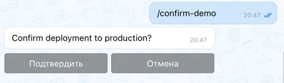

Назначение:

- бинарное решение (подтвердить/отменить)

Бизнес-логика (что ты получаешь):

- Явный пользовательский verdict перед потенциально опасным действием (деплой, удаление, публикация).
- На выходе всегда дискретное решение: `confirm` или `cancel`.
- Решение можно сразу маппить на ветку бизнес-процесса: выполнить операцию или завершить без side effects.

Конструктор:

- `label: str`
- `confirm_label: str = "Подтвердить"`
- `cancel_label: str = "Отмена"`
- базовые аргументы виджета (`message`, `bot`, `command`, `additional_markup`, `result_mode`)

Ключи/константы:

- `CONFIRM_ACTION_KEY`
- `CONFIRM_ACTION`
- `CANCEL_ACTION`

Хелперы:

- `get_action(message) -> str`
- `is_confirmed(message) -> bool`
- `is_cancelled(message) -> bool`

### 5.2 `ApprovalWidget`

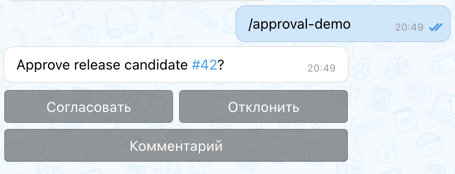

Назначение:

- согласование в трех состояниях: approve/reject/comment

Бизнес-логика (что ты получаешь):

- Унифицированную точку согласования для процессов, где недостаточно бинарного выбора.
- На выходе одно из действий: `approve`, `reject`, `comment`.
- Прямое ветвление бизнес-процесса: запуск следующего шага, отклонение, запрос дополнительной информации.

Конструктор:

- `label: str`
- `approve_label: str = "Согласовать"`
- `reject_label: str = "Отклонить"`
- `comment_label: str = "Комментарий"`
- базовые аргументы виджета

Константы:

- `APPROVAL_ACTION_KEY`
- `APPROVE_ACTION`
- `REJECT_ACTION`
- `COMMENT_ACTION`

Хелперы:

- `get_action(message) -> str`
- `is_approved(message) -> bool`

### 5.3 `SelectWidget`

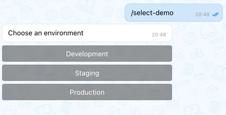

Назначение:

- выбор одного значения из списка

Бизнес-логика (что ты получаешь):

- Одно нормализованное значение из набора альтернатив (окружение, тариф, тип операции).
- Предсказуемый выход для downstream-логики: строковый `value`.
- Удобный вход для Strategy/роутинга в application-слое.

Типы:

- `SelectOption(value: str, label: str)`

Конструктор:

- `options: list[str | SelectOption]`
- `label: str`
- `selected_prefix: str = "• "`
- базовые аргументы виджета

Ключ:

- `SELECT_VALUE_KEY`

Хелпер:

- `get_value(message) -> str`

### 5.4 `MultiSelectWidget`

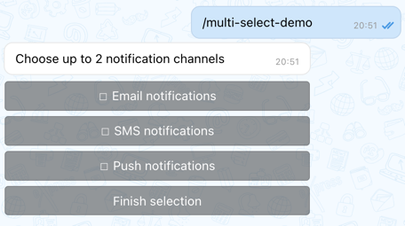

Назначение:

- множественный выбор с опциональным ограничением

Бизнес-логика (что ты получаешь):

- Набор выбранных флагов/опций в одном шаге (каналы уведомлений, разрешения, категории).
- Контроль бизнес-ограничений через `max_selected` (например, не более 2 вариантов).
- Состояние выбора хранится в metadata и устойчиво к последовательным кликам.

Конструктор:

- `options: list[str | SelectOption]`
- `label: str`
- `max_selected: int | None = None`
- базовые аргументы виджета

Ключи data/metadata:

- `MULTI_SELECT_VALUE_KEY` (кликнутое значение)
- `MULTI_SELECTED_VALUES_KEY` (состояние выбора в metadata)

Хелпер:

- `get_selected_values(message) -> list[str]`

### 5.5 `SearchSelectWidget`

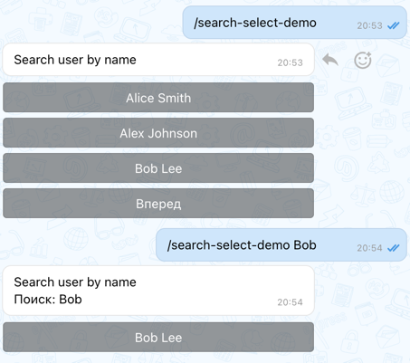

Назначение:

- поиск + пагинация + выбор

Бизнес-логика (что ты получаешь):

- Выбор одной сущности из большого справочника без перегрузки UI.
- Возможность искать по пользовательскому вводу (`message.argument`/`SEARCH_QUERY_KEY`) и выбрать точный `value`.
- Паттерн для каталога пользователей, сервисов, проектов, заявок.

Конструктор:

- `options: list[str | SelectOption]`
- `label: str`
- `page_size: int = 5`
- `empty_label: str = "Ничего не найдено"`
- `selected_prefix: str = "• "`
- базовые аргументы виджета

Ключи:

- `SEARCH_QUERY_KEY`
- `SEARCH_PAGE_KEY`
- для финального выбора используется `SELECT_VALUE_KEY`

Поведение:

- запрос берется из `message.data[SEARCH_QUERY_KEY]` или из `message.argument`
- фильтрация по `label` и `value`
- текущая страница хранится в callback data

### 5.6 `FormWizardWidget`

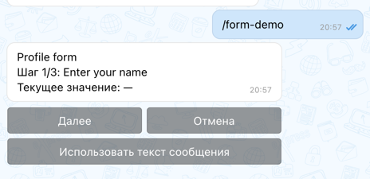

Назначение:

- пошаговая форма (next/back/cancel/reset)

Бизнес-логика (что ты получаешь):

- Сбор структурированных данных по шагам с явным состоянием процесса.
- На выходе словарь полей `values`, готовый для валидации и сохранения в доменную модель.
- Управляемый сценарий отмены/сброса без потери контроля над состоянием диалога.

Типы:

- `FormWizardStep(field: str, label: str)`

Конструктор:

- `steps: list[FormWizardStep]`
- `label: str`
- базовые аргументы виджета

Ключи и действия:

- `FORM_STEP_INDEX_KEY`
- `FORM_VALUES_KEY`
- `FORM_ACTION_KEY`
- `FORM_INPUT_KEY`
- действия:
  `FORM_ACTION_NEXT`,
  `FORM_ACTION_BACK`,
  `FORM_ACTION_CANCEL`,
  `FORM_ACTION_RESET`

Поля состояния:

- `values: dict[str, Any]`
- `step_index: int`
- `cancelled: bool`
- `is_completed: bool`
- `is_active: bool`

Хелпер:

- `get_values(message) -> dict[str, Any]`

### 5.7 `DateRangeWidget`

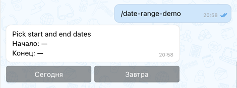

Назначение:

- выбор начала и конца периода + reset

Бизнес-логика (что ты получаешь):

- Валидный временной интервал (`start`, `end`) как вход для отчетов, аналитики, выборок из БД.
- Снижение ошибок пользователя: диапазон собирается поэтапно, с поддержкой reset.
- На выходе готовый `tuple[date, date]` для application-service.

Конструктор:

- `label: str = "Выбор периода"`
- базовые аргументы виджета

Ключи:

- `DATE_RANGE_START_KEY`
- `DATE_RANGE_END_KEY`
- `DATE_RANGE_CURSOR_KEY`
- `DATE_RANGE_SELECTED_DATE_KEY`
- `DATE_RANGE_ACTION_KEY`
- действие `DATE_RANGE_ACTION_RESET`

Поля состояния:

- `start: date | None`
- `end: date | None`
- `cursor: str`

Хелпер:

- `get_value(message) -> tuple[date, date]`

### 5.8 `TableWidget`

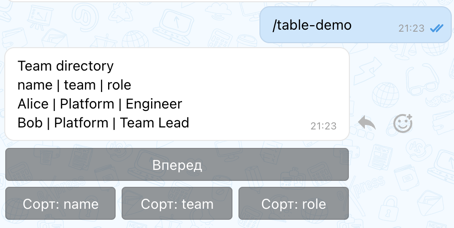

Назначение:

- табличный рендер с фильтрацией, сортировкой и пагинацией

Бизнес-логика (что ты получаешь):

- Управляемый просмотр набора данных (read-model) прямо в чате.
- Сохранение пользовательского контекста просмотра: фильтр, сортировка, страница.
- Базовый интерфейс для операционных списков (инциденты, заявки, пользователи) без отдельного фронтенда.

Конструктор:

- `rows: list[dict[str, Any]]`
- `columns: list[str]`
- `label: str = "Таблица"`
- `page_size: int = 5`
- базовые аргументы виджета

Ключи:

- `TABLE_PAGE_KEY`
- `TABLE_SORT_KEY`
- `TABLE_DESC_KEY`
- `TABLE_QUERY_KEY`

Поведение:

- query берется из callback data или из `message.argument`
- устойчивое состояние хранится в metadata

### 5.9 `AsyncJobWidget`

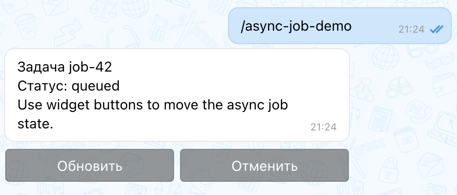

Назначение:

- отображение статуса async-задачи и управление действиями refresh/retry/cancel

Бизнес-логика (что ты получаешь):

- Единый UX для long-running процессов (импорт, расчет, синхронизация).
- Декларативные пользовательские команды управления жизненным циклом задачи.
- Наглядный статус и контролируемые переходы: queued -> running -> done/failed/cancelled.

Конструктор:

- `job_id: str`
- `status: str`
- `details: str = ""`
- базовые аргументы виджета

Ключи/константы:

- `ASYNC_JOB_ID_KEY`
- `ASYNC_JOB_STATUS_KEY`
- `ASYNC_JOB_ACTION_KEY`
- статусы:
  `ASYNC_JOB_QUEUED`,
  `ASYNC_JOB_RUNNING`,
  `ASYNC_JOB_DONE`,
  `ASYNC_JOB_FAILED`,
  `ASYNC_JOB_CANCELLED`
- действия:
  `ASYNC_JOB_ACTION_REFRESH`,
  `ASYNC_JOB_ACTION_RETRY`,
  `ASYNC_JOB_ACTION_CANCEL`

Хелперы:

- `get_action(message) -> str`
- `get_status(message) -> str`

### 5.10 `FileBatchWidget`

Файл: `/Users/aleksandrosovskii/PycharmProjects/pybotx_stable/pybotx/widgets/file_batch.py`

Назначение:

- отображение статусов пакетной обработки файлов, пагинация, retry failed

Бизнес-логика (что ты получаешь):

- Операционный контроль batch-обработки большого числа файлов.
- Быстрый доступ к конкретному файлу и retry только проблемных элементов.
- Прозрачную картину по пакету: сколько успешно, сколько в процессе, сколько с ошибкой.

Типы:

- `BatchFileItem(name: str, status: str, error: str = "")`

Конструктор:

- `files: list[BatchFileItem | dict | str] | None`
- `label: str = "Пакет файлов"`
- `page_size: int = 5`
- базовые аргументы виджета

Ключи/константы:

- `FILE_BATCH_FILES_KEY`
- `FILE_BATCH_PAGE_KEY`
- `FILE_BATCH_ACTION_KEY`
- `FILE_BATCH_FILE_NAME_KEY`
- действия:
  `FILE_BATCH_ACTION_PREV`,
  `FILE_BATCH_ACTION_NEXT`,
  `FILE_BATCH_ACTION_RETRY_FAILED`,
  `FILE_BATCH_ACTION_ITEM`

Хелперы:

- `get_action(message) -> str`
- `get_selected_file(message) -> str`

### 5.11 `CalendarWidget`

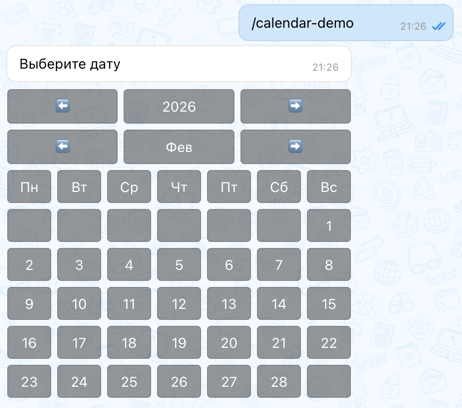

Назначение:

- календарный пикер месяца с ограничениями периода

Бизнес-логика (что ты получаешь):

- Выбор одной даты с ограничениями доменных правил (границы периода, запрет прошлого).
- Нормализованное значение даты для последующих сценариев (бронирование, планирование, запуск по дате).
- Контролируемую навигацию по календарю без ручного парсинга дат из текста.

Конструктор:

- `start_date: date | None = None`
- `end_date: date = date.max`
- `include_past: bool = False`
- базовые аргументы виджета

Ключи:

- `MONTH_TO_DISPLAY_KEY`
- `SELECTED_DATE_KEY`

Хелпер:

- `await get_value(message, bot, send_feedback=True) -> date`

### 5.12 `CarouselWidget`

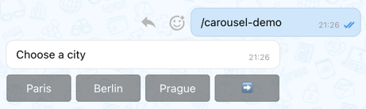

Назначение:

- горизонтальная/вертикальная листалка с выбором значения

Бизнес-логика (что ты получаешь):

- Пошаговый выбор из длинного списка без перегруженного интерфейса.
- На выходе одно выбранное значение, пригодное для прямого использования в бизнес-операции.
- Гибкий UX: циклический/нециклический режим, inline или построчный формат.

Конструктор:

- `widget_content: Sequence[Any]`
- `label: str`
- `start_from: int = 0`
- `displayed_content_count: int = 3`
- `control_labels: tuple[str, str] | None = None`
- `inline: bool = True`
- `loop: bool = True`
- `show_numbers: bool = False`
- базовые аргументы виджета

Ключи/константы:

- `START_FROM_KEY`
- `SELECTED_VALUE_KEY`
- `SELECTED_VALUE_LABEL_KEY`
- `MESSAGE_LABEL_KEY`
- служебные маркеры управления:
  `LEFT_PRESSED`,
  `RIGHT_PRESSED`

Хелпер:

- `await get_value(message, bot, send_feedback=True) -> str | None`

### 5.13 `CheckListWidget`

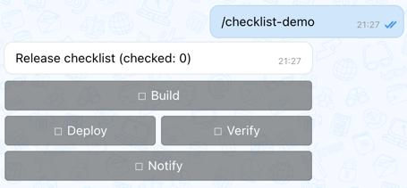

Назначение:

- простой чеклист с поддержкой вложенных рядов

Бизнес-логика (что ты получаешь):

- Чеклист статусов выполнения этапов процесса (release checklist, onboarding checklist).
- На выходе текущий набор отмеченных пунктов, который можно хранить в metadata/репозитории.
- Простой механизм контроля прогресса без полноценной FSM-формы.

Конструктор:

- `widget_content: Sequence[Any]`
- `label: str`
- базовые аргументы виджета

Ключи:

- `SELECTED_ITEM_KEY`
- `CHECKED_ITEMS_KEY`

Хелперы:

- `get_value(message) -> Any`
- `get_checked_items(message) -> list[Any]`

### 5.14 `ChecktableWidget`

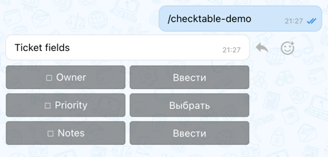

Назначение:

- структурированная таблица полей с чекбоксами и значениями

Бизнес-логика (что ты получаешь):

- Компактный интерфейс заполнения/очистки набора полей карточки сущности.
- Явное разделение: заполнено поле или нет (`undefined` vs value).
- Модель для сценариев «быстрой правки» тикета/задачи прямо в чате.

Типы:

- `CheckboxContent[T]` с полями:
  `label`, `command`, `checkbox_value`, `mapping`, `data`
- поддерживается sentinel `undefined`

Конструктор:

- `checkboxes: list[CheckboxContent[Any]]`
- `label: str`
- `uncheck_command: str`
- базовые аргументы виджета

Примечания:

- если `checkbox_value` равен `undefined`, поле считается незаполненным
- `mapping` позволяет отображать пользовательские подписи вместо технических значений

### 5.15 `RangeWidget`

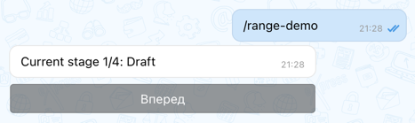

Назначение:

- последовательная навигация по набору элементов

Бизнес-логика (что ты получаешь):

- Управляемый выбор текущего шага/этапа процесса.
- Явный индекс и текущее значение для application-логики.
- Подходит для сценариев со стадиями: Draft -> Review -> Approved -> Done.

Конструктор:

- `elements: Sequence[str] | None = None`
- `label_template: str = "Current element: {element}"`
- `forward_label: str = "Вперед"`
- `backward_label: str = "Назад"`
- `empty_body: str = "Список пуст"`
- базовые аргументы виджета

Ключи:

- `CURRENT_INDEX_KEY`
- `ELEMENTS_KEY`

Хелпер:

- `get_value(message) -> str`

### 5.16 `PaginationWidget`

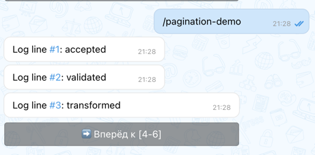

Назначение:

- пагинация списка сообщений (`str` или `OutgoingMessage`) в несколько сообщений бота

Бизнес-логика (что ты получаешь):

- Читаемую выдачу больших наборов данных без ограничения одним сообщением.
- Переиспользуемую механику «листания» для логов, отчетов, длинных списков результатов.
- Сохранение идентификаторов сообщений для последующего обновления уже выведенных страниц.

Конструктор:

- `widget_content: list[OutgoingMessage | str]`
- `paginate_by: int` (`> 0`)
- `delay_between_messages: float = 0.5` (`>= 0`)
- базовые аргументы виджета

Ключи:

- `START_FROM_KEY`
- `MESSAGE_IDS_KEY`

Поведение:

- первый рендер может отправить несколько сообщений
- переключение страницы обновляет уже отправленные сообщения по ID из metadata
- последнее сообщение содержит управляющие кнопки пагинации

### 5.17 `MessagesPagerWidget`

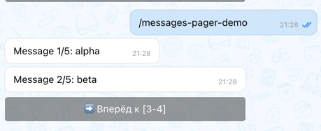

Назначение:

- упрощенный API над `PaginationWidget` для последовательности строк

Бизнес-логика (что ты получаешь):

- Быстрый путь показать пользователю большой список текстовых элементов с пагинацией.
- Минимум кода для cases «вывести N сообщений по шаблону».
- Подходящий слой presentation для логов, уведомлений, истории операций.

Конструктор:

- `elements: Sequence[str]`
- `page_size: int`
- `item_template: str = "Element: {element}"`
- `delay_between_messages: float = 0.5`
- базовые аргументы виджета

## 6. `MessageMarkup` и композиция разметки

Файл: `/Users/aleksandrosovskii/PycharmProjects/pybotx_stable/pybotx/widgets/markup.py`

`MessageMarkup`:

- обертка над `BubbleMarkup` + `KeyboardMarkup`
- вспомогательные методы:
  `add_bubble(...)`,
  `add_keyboard(...)`

Сценарий использования:

- основные кнопки виджета формируются внутри класса виджета
- дополнительные глобальные кнопки можно передавать через `additional_markup`
- итоговый markup объединяется в `Widget.add_additional_markup()`

## 7. Паттерны для команд

### 7.1 Предпочтительный (декларативный) паттерн

```python
@collector.command("/select-demo", description="Select demo")
@widget_command(
    before=on_data_key(
        "select_value",
        lambda widget: f"Selected: {widget.message.data['select_value']}",
    ),
)
async def select_demo_handler(message: IncomingMessage, bot: Bot) -> SelectWidget:
    return SelectWidget(
        options=["dev", "prod"],
        label="Choose env",
        message=message,
        bot=bot,
        command="/select-demo",
    )
```

### 7.2 Замена виджета в хуке (пересборка состояния)

```python
def retry_failed(widget: FileBatchWidget) -> RunnerHookResult:
    updated_files = [...]
    replacement = FileBatchWidget(
        files=updated_files,
        label="Batch status",
        message=widget.message,
        bot=widget.bot,
        command=widget.command,
    )
    return RunnerHookResult(widget=replacement, should_display=True)
```

### 7.3 Сводка по завершению (`after`)

```python
@widget_command(
    after=on_completed(
        lambda widget: widget.is_completed,
        lambda widget: f"Done: {widget.values}",
    ),
)
async def form_handler(message: IncomingMessage, bot: Bot) -> FormWizardWidget:
    ...
```

## 8. Как писать собственные виджеты

### 8.1 Минимальный кастомный виджет

```python
from typing import Any

from pybotx.models.message.incoming_message import IncomingMessage
from pybotx.widgets.base import Widget

COUNTER_VALUE_KEY = "counter_value"


def _safe_int(value: object, default: int = 0) -> int:
    if isinstance(value, int):
        return value
    if isinstance(value, str) and value.isdigit():
        return int(value)
    return default


class CounterWidget(Widget):
    def __init__(self, label: str, *args: Any, **kwargs: Any) -> None:
        super().__init__(*args, **kwargs)
        value = _safe_int(
            self.message.data.get(
                COUNTER_VALUE_KEY,
                self.message.metadata.get(COUNTER_VALUE_KEY, 0),
            ),
        )
        self.value = max(value, 0)
        self.widget_metadata[COUNTER_VALUE_KEY] = self.value
        self.widget_message.body = f"{label}: {self.value}"

    def add_markup(self) -> None:
        self.widget_bubbles.add_button(
            command=self.command,
            label="+1",
            data={COUNTER_VALUE_KEY: self.value + 1},
        )
        if self.value > 0:
            self.widget_bubbles.add_button(
                command=self.command,
                label="-1",
                data={COUNTER_VALUE_KEY: self.value - 1},
                new_row=False,
            )
```

### 8.2 Команда для кастомного виджета

```python
from pybotx.widgets import on_data_key, widget_command


@collector.command("/counter", description="Counter widget")
@widget_command(
    before=on_data_key(
        COUNTER_VALUE_KEY,
        lambda widget: f"Counter updated: {widget.message.data[COUNTER_VALUE_KEY]}",
        should_display=True,
    ),
)
async def counter_handler(message: IncomingMessage, bot: Bot) -> CounterWidget:
    return CounterWidget(
        label="Counter",
        message=message,
        bot=bot,
        command="/counter",
    )
```

### 8.3 Правила проектирования собственных виджетов

1. Держите класс виджета сфокусированным на UI и переходах состояния.
2. Сетевые вызовы/БД/бизнес-решения выносите в сервисный слой до сборки виджета.
3. Всегда валидируйте и нормализуйте `message.data` и `message.metadata`.
4. Не доверяйте типам callback payload.
5. Храните в metadata достаточно данных для восстановления состояния на следующем клике.
6. Для всех ключей callback/metadata используйте явные константы.
7. Для элементов списков предпочитайте неизменяемые структуры (`dataclass(frozen=True)`).
8. Геттеры действий делайте строгими и детерминированными (бросайте `RuntimeError` при невалидном action).

### 8.4 Идемпотентность и повторная доставка

Callback-события могут приходить повторно.
Для устойчивого поведения:

- проектируйте переходы состояния, безопасные при повторе одного и того же события
- внешние side-effect операции защищайте idempotency key (например, `chat_id + source_sync_id + action`)
- отделяйте изменение состояния от внешних эффектов
- не полагайтесь на exactly-once доставку

## 9. Стратегия тестирования

### 9.1 Unit-тесты для класса виджета

Что тестировать:

- восстановление состояния из metadata в конструкторе
- изменение состояния по callback data
- итоговый `widget_message.body`
- сформированные bubbles/keyboard
- edge-cases: невалидный payload, пустые данные, выход за границы страницы/индекса

Текущие примеры:

- `/Users/aleksandrosovskii/PycharmProjects/pybotx_stable/tests/widgets/test_select.py`
- `/Users/aleksandrosovskii/PycharmProjects/pybotx_stable/tests/widgets/test_table.py`
- `/Users/aleksandrosovskii/PycharmProjects/pybotx_stable/tests/widgets/test_pagination.py`

### 9.2 Тесты runner/декоратора

Что тестировать:

- ветки `before` и `after`
- сценарии `should_display=True/False`
- замену виджета через `RunnerHookResult.widget`
- поведение обертки `@widget_command`
- безопасный путь `on_action`, когда action отсутствует (`RuntimeError`)

Референс:

- `/Users/aleksandrosovskii/PycharmProjects/pybotx_stable/tests/widgets/test_runner.py`

### 9.3 Интеграционные тесты (рекомендовано)

Для production-бота:

- e2e-поток: команда -> callback -> обновление сообщения
- проверка корректного сохранения metadata между кликами
- проверка обоих режимов результата: `edit` и `message`

## 10. Диагностика проблем

### Виджет отправляет новые сообщения вместо редактирования

Проверьте:

- у входящего сообщения есть `pybotx_widget = 1` в metadata
- у входящего сообщения есть `source_sync_id`
- путь выполнения идет через `Widget.send_or_update_message` (через `display()` / `send_result()`)

### `on_action` не срабатывает

Проверьте:

- ваш `get_action` действительно бросает `RuntimeError` при отсутствии/невалидности action
- callback data содержит ожидаемый ключ
- строка action совпадает с ключом в `actions`

### Результат пришел отдельным сообщением, хотя ожидался edit

Проверьте, какой режим результата выбран:

- явный `result_mode` в конструкторе виджета
- metadata `pybotx_widget_result_mode`
- значение в аргументе команды (может переопределять режим)

## 11. Миграция: ручной Runner -> декоратор

Было:

```python
runner = WidgetRunner(message, bot)
widget = ConfirmWidget(...)
await runner.run(widget=widget, before=_before, after=_after)
```

Стало:

```python
@widget_command(before=..., after=...)
async def handler(message: IncomingMessage, bot: Bot) -> ConfirmWidget:
    return ConfirmWidget(...)
```

Преимущества:

- меньше boilerplate
- более явный и единообразный контракт хендлера
- переиспользуемые хуки
- проще тестировать и поддерживать командой

## 12. Публичные экспорты (`pybotx.widgets`)

Ключевые экспорты:

- все классы виджетов из раздела 5
- вспомогательные типы: `BatchFileItem`, `CheckboxContent`, `FormWizardStep`, `SelectOption`
- вспомогательные объекты: `undefined`, `Undefined`
- runner API:
  `RunnerHookResult`,
  `WidgetRunner`,
  `widget_command`,
  `on_data_key`,
  `on_completed`,
  `on_action`

Актуальный список смотрите в:

- `/Users/aleksandrosovskii/PycharmProjects/pybotx_stable/pybotx/widgets/__init__.py`
