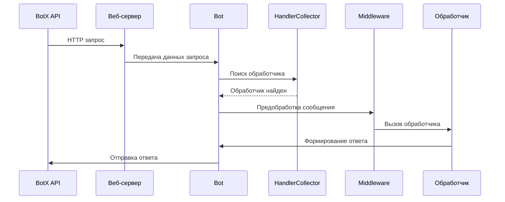
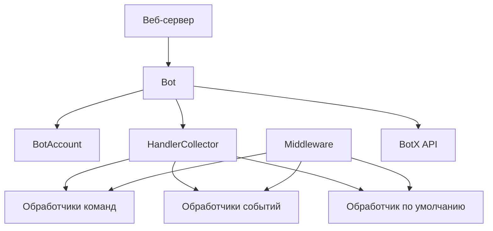

# Обзор архитектуры

В этом разделе описана высокоуровневая архитектура библиотеки pybotx и основные компоненты, из которых она состоит.


## Основные компоненты

### Bot

Класс `Bot` является центральным компонентом библиотеки pybotx. Он отвечает за:

- Обработку входящих сообщений и событий
- Отправку исходящих сообщений
- Управление жизненным циклом бота (запуск и остановка)
- Взаимодействие с BotX API

```python
from pybotx import Bot, BotAccountWithSecret

bot = Bot(
    collectors=[collector],
    bot_accounts=[
        BotAccountWithSecret(
            id=UUID("123e4567-e89b-12d3-a456-426655440000"),
            cts_url="https://cts.example.com",
            secret_key="e29b417773f2feab9dac143ee3da20c5",
        ),
    ],
)
```

### BotAccount

Класс `BotAccount` (и его подкласс `BotAccountWithSecret`) представляет учетную запись бота в системе BotX. Каждый бот может иметь несколько учетных записей для работы с разными CTS (Communication & Transfer Server).

```python
from pybotx import BotAccountWithSecret
from uuid import UUID

account = BotAccountWithSecret(
    id=UUID("123e4567-e89b-12d3-a456-426655440000"),  # Уникальный идентификатор бота
    cts_url="https://cts.example.com",  # URL сервера CTS
    secret_key="e29b417773f2feab9dac143ee3da20c5",  # Секретный ключ для авторизации
)
```

### HandlerCollector

Класс `HandlerCollector` (или просто Collector) отвечает за сбор и регистрацию обработчиков команд и событий. Он позволяет:

- Регистрировать обработчики команд с помощью декоратора `@collector.command`
- Регистрировать обработчики системных событий с помощью декораторов `@collector.chat_created`, `@collector.smartapp_event` и др.
- Регистрировать обработчик сообщений по умолчанию с помощью декоратора `@collector.default_message_handler`
- Объединять несколько коллекторов в один с помощью метода `include`

```python
from pybotx import HandlerCollector, IncomingMessage, Bot

collector = HandlerCollector()

@collector.command("/hello", description="Поприветствовать пользователя")
async def hello_handler(message: IncomingMessage, bot: Bot) -> None:
    await bot.answer_message(f"Привет, {message.sender.username}!")

@collector.default_message_handler
async def default_handler(message: IncomingMessage, bot: Bot) -> None:
    await bot.answer_message("Я не понимаю эту команду.")
```

### Middleware

Middleware (промежуточное ПО) — это функции, которые выполняются до и после обработки сообщения основным обработчиком. Они позволяют:

- Предобрабатывать входящие сообщения
- Добавлять данные в контекст сообщения
- Перехватывать и изменять ответы
- Выполнять действия после обработки сообщения (логирование, метрики и т.д.)

```python
from pybotx import IncomingMessage, Bot, IncomingMessageHandlerFunc

async def logging_middleware(
    message: IncomingMessage,
    bot: Bot,
    call_next: IncomingMessageHandlerFunc,
) -> None:
    print(f"Получено сообщение: {message.body}")

    # Вызов следующего обработчика в цепочке
    await call_next(message, bot)

    print("Сообщение обработано")

# Применение middleware к коллектору
collector = HandlerCollector(middlewares=[logging_middleware])
```

## Взаимодействие компонентов

Взаимодействие основных компонентов pybotx можно представить следующим образом:

1. **Веб-сервер** получает HTTP-запрос от BotX API
2. **Bot** принимает запрос и определяет тип события (команда, системное событие и т.д.)
3. **HandlerCollector** находит подходящий обработчик для события
4. **Middleware** выполняют предобработку сообщения
5. **Обработчик** обрабатывает сообщение и формирует ответ
6. **Bot** отправляет ответ через BotX API

## Жизненный цикл сообщения



## Диаграмма архитектуры

Высокоуровневая архитектура pybotx:



## Расширяемость

pybotx спроектирован с учетом расширяемости. Вы можете:

- Создавать собственные middleware для добавления функциональности
- Объединять несколько коллекторов для модульной организации кода

```python
# Пример модульной организации кода с несколькими коллекторами

# admin_handlers.py
admin_collector = HandlerCollector()

@admin_collector.command("/admin", description="Административная команда")
async def admin_handler(message: IncomingMessage, bot: Bot) -> None:
    # ...

# user_handlers.py
user_collector = HandlerCollector()

@user_collector.command("/help", description="Показать справку")
async def help_handler(message: IncomingMessage, bot: Bot) -> None:
    # ...

# main.py
from admin_handlers import admin_collector
from user_handlers import user_collector

# Объединение коллекторов
main_collector = HandlerCollector()
main_collector.include(admin_collector, user_collector)

bot = Bot(collectors=[main_collector], bot_accounts=[...])
```

## См. также

- [Жизненный цикл бота](lifecycle.md)
- [Типизация](typing.md)
- [Обработчики команд](../handlers/commands.md)
- [Middleware](../handlers/middlewares.md)
- [Коллекторы](../handlers/collectors.md)
