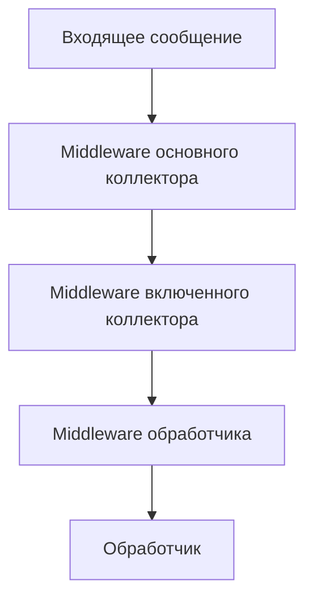

# Коллекторы

В этом разделе описаны коллекторы обработчиков в pybotx, их настройка и использование.

## Введение

Коллектор обработчиков (`HandlerCollector`) — это класс, который отвечает за сбор и регистрацию обработчиков команд и событий. Он позволяет:

- Регистрировать обработчики команд с помощью декоратора `@collector.command`
- Регистрировать обработчики системных событий с помощью декораторов `@collector.chat_created`, `@collector.smartapp_event` и др.
- Регистрировать обработчик сообщений по умолчанию с помощью декоратора `@collector.default_message_handler`
- Объединять несколько коллекторов в один с помощью метода `include`
- Применять middleware ко всем обработчикам коллектора

Коллекторы помогают организовать код бота в модули и повторно использовать компоненты.

## Создание коллектора

Для создания коллектора используется класс `HandlerCollector`:

```python
from pybotx import HandlerCollector

# Создание коллектора без middleware
collector = HandlerCollector()

# Создание коллектора с middleware
collector_with_middleware = HandlerCollector(middlewares=[logging_middleware, auth_middleware])
```

## Вложенные коллекторы

Коллекторы можно включать друг в друга с помощью метода `include`. Это позволяет организовать код бота в модули и повторно использовать компоненты.

```python
from pybotx import HandlerCollector

# Создаем коллекторы для разных модулей
admin_collector = HandlerCollector()
user_collector = HandlerCollector()
help_collector = HandlerCollector()

# Регистрируем обработчики в каждом коллекторе
@admin_collector.command("/admin", description="Административная команда")
async def admin_handler(message: IncomingMessage, bot: Bot) -> None:
    # ...

@user_collector.command("/profile", description="Показать профиль")
async def profile_handler(message: IncomingMessage, bot: Bot) -> None:
    # ...

@help_collector.command("/help", description="Показать справку")
async def help_handler(message: IncomingMessage, bot: Bot) -> None:
    # ...

# Создаем главный коллектор
main_collector = HandlerCollector()

# Включаем все коллекторы в главный
main_collector.include(admin_collector, user_collector, help_collector)

# Создаем бота с главным коллектором
bot = Bot(collectors=[main_collector], bot_accounts=[...])
```

При включении коллекторов все обработчики из включаемых коллекторов добавляются в основной коллектор. Если в разных коллекторах есть обработчики с одинаковыми командами, будет использоваться последний включенный обработчик.

## Шаринг middleware

Middleware, зарегистрированные в коллекторе, применяются ко всем обработчикам этого коллектора. При включении коллекторов middleware из основного коллектора также применяются к обработчикам из включенных коллекторов.

```python
from pybotx import HandlerCollector, IncomingMessage, Bot, IncomingMessageHandlerFunc

# Middleware для логирования
async def logging_middleware(
    message: IncomingMessage,
    bot: Bot,
    call_next: IncomingMessageHandlerFunc,
) -> None:
    print(f"Получено сообщение: {message.body}")
    await call_next(message, bot)
    print("Сообщение обработано")

# Middleware для аутентификации
async def auth_middleware(
    message: IncomingMessage,
    bot: Bot,
    call_next: IncomingMessageHandlerFunc,
) -> None:
    message.state.is_authenticated = True
    await call_next(message, bot)

# Создаем коллектор с middleware
main_collector = HandlerCollector(middlewares=[logging_middleware])

# Создаем другой коллектор с другим middleware
admin_collector = HandlerCollector(middlewares=[auth_middleware])

# Включаем admin_collector в main_collector
main_collector.include(admin_collector)

# Теперь все обработчики из admin_collector будут использовать оба middleware:
# сначала logging_middleware, затем auth_middleware
```

Порядок выполнения middleware при включении коллекторов:

1. Middleware из основного коллектора
2. Middleware из включенного коллектора
3. Middleware, указанные непосредственно для обработчика



## Организация кода

Коллекторы позволяют организовать код бота в модули. Рекомендуется создавать отдельные файлы для каждого модуля и экспортировать из них коллекторы.

```python
# admin_handlers.py
from pybotx import HandlerCollector, IncomingMessage, Bot

admin_collector = HandlerCollector()

@admin_collector.command("/admin", description="Административная команда")
async def admin_handler(message: IncomingMessage, bot: Bot) -> None:
    # ...

# user_handlers.py
from pybotx import HandlerCollector, IncomingMessage, Bot

user_collector = HandlerCollector()

@user_collector.command("/profile", description="Показать профиль")
async def profile_handler(message: IncomingMessage, bot: Bot) -> None:
    # ...

# main.py
from pybotx import Bot, HandlerCollector, BotAccountWithSecret
from admin_handlers import admin_collector
from user_handlers import user_collector

# Создаем главный коллектор
main_collector = HandlerCollector()

# Включаем все коллекторы в главный
main_collector.include(admin_collector, user_collector)

# Создаем бота с главным коллектором
bot = Bot(collectors=[main_collector], bot_accounts=[...])
```

## Примеры использования

### Модульная организация бота

```python
# common_middlewares.py
from pybotx import IncomingMessage, Bot, IncomingMessageHandlerFunc
from uuid import uuid4

async def request_id_middleware(
    message: IncomingMessage,
    bot: Bot,
    call_next: IncomingMessageHandlerFunc,
) -> None:
    message.state.request_id = str(uuid4())
    await call_next(message, bot)

# admin_module.py
from pybotx import HandlerCollector, IncomingMessage, Bot, IncomingMessageHandlerFunc
from uuid import UUID

admin_collector = HandlerCollector()

# Middleware для проверки прав администратора
async def admin_auth_middleware(
    message: IncomingMessage,
    bot: Bot,
    call_next: IncomingMessageHandlerFunc,
) -> None:
    ADMIN_HUIDS = (UUID("123e4567-e89b-12d3-a456-426614174000"),)
    
    if message.sender.huid not in ADMIN_HUIDS:
        await bot.answer_message("У вас нет прав для выполнения этой команды")
        return
    
    await call_next(message, bot)

# Применяем middleware ко всем обработчикам в коллекторе
admin_collector = HandlerCollector(middlewares=[admin_auth_middleware])

@admin_collector.command("/admin", description="Административная команда")
async def admin_handler(message: IncomingMessage, bot: Bot) -> None:
    await bot.answer_message("Вы выполнили административную команду")

@admin_collector.command("/stats", description="Показать статистику")
async def stats_handler(message: IncomingMessage, bot: Bot) -> None:
    await bot.answer_message("Статистика: ...")

# user_module.py
from pybotx import HandlerCollector, IncomingMessage, Bot

user_collector = HandlerCollector()

@user_collector.command("/help", description="Показать справку")
async def help_handler(message: IncomingMessage, bot: Bot) -> None:
    await bot.answer_message(
        "Доступные команды:\n"
        "/help - Показать справку\n"
        "/profile - Показать профиль\n"
        "/admin - Административная команда (только для администраторов)\n"
        "/stats - Показать статистику (только для администраторов)"
    )

@user_collector.command("/profile", description="Показать профиль")
async def profile_handler(message: IncomingMessage, bot: Bot) -> None:
    await bot.answer_message(f"Профиль пользователя {message.sender.username}")

# main.py
from pybotx import Bot, HandlerCollector, BotAccountWithSecret
from common_middlewares import request_id_middleware
from admin_module import admin_collector
from user_module import user_collector

# Создаем главный коллектор с общим middleware
main_collector = HandlerCollector(middlewares=[request_id_middleware])

# Включаем все коллекторы в главный
main_collector.include(admin_collector, user_collector)

# Создаем бота с главным коллектором
bot = Bot(collectors=[main_collector], bot_accounts=[...])
```

### Повторное использование коллекторов

```python
from pybotx import HandlerCollector, IncomingMessage, Bot

# Создаем коллектор с базовыми командами, который можно использовать в разных ботах
base_collector = HandlerCollector()

@base_collector.command("/help", description="Показать справку")
async def help_handler(message: IncomingMessage, bot: Bot) -> None:
    await bot.answer_message("Базовая справка")

@base_collector.command("/about", description="О боте")
async def about_handler(message: IncomingMessage, bot: Bot) -> None:
    await bot.answer_message("Это базовый бот")

# Создаем коллектор для первого бота
bot1_collector = HandlerCollector()
bot1_collector.include(base_collector)  # Включаем базовые команды

@bot1_collector.command("/bot1", description="Специфичная команда для бота 1")
async def bot1_handler(message: IncomingMessage, bot: Bot) -> None:
    await bot.answer_message("Это бот 1")

# Переопределяем команду /help для бота 1
@bot1_collector.command("/help", description="Показать справку")
async def bot1_help_handler(message: IncomingMessage, bot: Bot) -> None:
    await bot.answer_message("Справка для бота 1")

# Создаем коллектор для второго бота
bot2_collector = HandlerCollector()
bot2_collector.include(base_collector)  # Включаем базовые команды

@bot2_collector.command("/bot2", description="Специфичная команда для бота 2")
async def bot2_handler(message: IncomingMessage, bot: Bot) -> None:
    await bot.answer_message("Это бот 2")

# Создаем ботов с соответствующими коллекторами
bot1 = Bot(collectors=[bot1_collector], bot_accounts=[...])
bot2 = Bot(collectors=[bot2_collector], bot_accounts=[...])
```

> **Note**
> 
> При включении коллекторов с одинаковыми командами, приоритет имеет последний включенный обработчик. Если вы хотите переопределить команду, определите ее после включения коллектора или переопределите ее в основном коллекторе.

## См. также

- [Обработчики команд](commands.md)
- [Обработчик сообщений по умолчанию](default.md)
- [Обработчики событий](events.md)
- [Middleware](middlewares.md)
- [Архитектура](../architecture/overview.md)