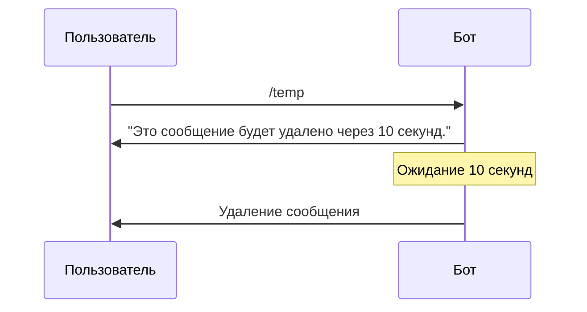

# Удаление сообщений

В этом разделе описаны способы удаления сообщений в pybotx.

## Введение

pybotx позволяет удалять ранее отправленные сообщения с помощью метода `bot.delete_message()`. Это полезно для создания временных сообщений, очистки чата от устаревшей информации или реализации функций отмены действий.

Для удаления сообщения необходимо знать его уникальный идентификатор (`sync_id`), который возвращается при отправке сообщения.

## Метод удаления сообщений

Метод `bot.delete_message()` используется для удаления ранее отправленных сообщений:

```python
async def delete_message(
    self,
    *,
    bot_id: UUID,
    sync_id: UUID,
) -> None:
    # ...
```

Параметры метода:
- `bot_id` — ID бота, от имени которого было отправлено сообщение
- `sync_id` — уникальный идентификатор сообщения, которое нужно удалить

> **Note**
> 
> После удаления сообщения его невозможно восстановить. Удаление происходит для всех участников чата.

## Получение sync_id сообщения

Существует несколько способов получить `sync_id` сообщения:

1. **При отправке сообщения** — методы `bot.answer_message()` и `bot.send_message()` возвращают `sync_id`:

```python
sync_id = await bot.answer_message("Временное сообщение")
```

2. **Из нажатия на кнопку** — когда пользователь нажимает на кнопку, в объекте `message` доступен атрибут `source_sync_id`, который содержит `sync_id` сообщения, в котором была нажата кнопка:

```python
@collector.command("/delete")
async def delete_handler(message: IncomingMessage, bot: Bot) -> None:
    if message.source_sync_id:
        # Пользователь нажал на кнопку "Удалить"
        await bot.delete_message(
            bot_id=message.bot.id,
            sync_id=message.source_sync_id,
        )
    else:
        # Первичный вызов команды
        bubbles = BubbleMarkup()
        bubbles.add_button(
            command="/delete",
            label="Удалить",
            background_color="#dc3545",
        )
        await bot.answer_message("Нажмите на кнопку для удаления сообщения", bubbles=bubbles)
```

## Само-удаляющееся сообщение

Одним из полезных применений удаления сообщений является создание само-удаляющихся сообщений, которые автоматически исчезают через определенное время. Это можно реализовать с помощью `asyncio.sleep`:

```python
from pybotx import HandlerCollector, IncomingMessage, Bot
import asyncio

collector = HandlerCollector()

@collector.command("/temp", description="Отправить временное сообщение")
async def temp_message_handler(message: IncomingMessage, bot: Bot) -> None:
    # Определяем время жизни сообщения (в секундах)
    lifetime = 10
    
    # Отправляем сообщение и получаем его sync_id
    sync_id = await bot.answer_message(
        f"Это сообщение будет удалено через {lifetime} секунд."
    )
    
    # Ждем указанное время
    await asyncio.sleep(lifetime)
    
    # Удаляем сообщение
    try:
        await bot.delete_message(
            bot_id=message.bot.id,
            sync_id=sync_id,
        )
    except Exception as e:
        # Обрабатываем возможные ошибки (например, сообщение уже удалено)
        print(f"Ошибка при удалении сообщения: {e}")
```

В этом примере:
1. Бот отправляет сообщение с предупреждением о том, что оно будет удалено через 10 секунд.
2. Бот ожидает 10 секунд с помощью `asyncio.sleep()`.
3. По истечении времени бот удаляет сообщение.



> **Note**
> 
> Использование `asyncio.sleep()` не блокирует выполнение других операций бота, так как pybotx работает асинхронно. Бот может обрабатывать другие сообщения во время ожидания.

## Примеры использования

### Удаление сообщения по кнопке

```python
from pybotx import HandlerCollector, IncomingMessage, Bot, BubbleMarkup

collector = HandlerCollector()

@collector.command("/delete_button", description="Сообщение с кнопкой удаления")
async def delete_button_handler(message: IncomingMessage, bot: Bot) -> None:
    if message.source_sync_id:
        # Пользователь нажал на кнопку "Удалить"
        await bot.delete_message(
            bot_id=message.bot.id,
            sync_id=message.source_sync_id,
        )
        
        # Отправляем подтверждение (опционально)
        await bot.answer_message("Сообщение удалено")
    else:
        # Создаем кнопку для удаления
        bubbles = BubbleMarkup()
        bubbles.add_button(
            command="/delete_button",
            label="Удалить",
            background_color="#dc3545",
        )
        
        # Отправляем сообщение с кнопкой
        await bot.answer_message(
            "Это сообщение можно удалить, нажав на кнопку ниже.",
            bubbles=bubbles,
        )
```

### Временное уведомление

```python
from pybotx import HandlerCollector, IncomingMessage, Bot
import asyncio

collector = HandlerCollector()

@collector.command("/notify", description="Отправить временное уведомление")
async def notify_handler(message: IncomingMessage, bot: Bot) -> None:
    if not message.argument:
        await bot.answer_message("Пожалуйста, укажите текст уведомления")
        return
    
    # Отправляем уведомление
    notification_text = message.argument
    sync_id = await bot.answer_message(f"📢 {notification_text}")
    
    # Отправляем подтверждение отправителю
    await bot.answer_message("Уведомление отправлено и будет автоматически удалено через 1 минуту")
    
    # Ждем 1 минуту
    await asyncio.sleep(60)
    
    # Удаляем уведомление
    try:
        await bot.delete_message(
            bot_id=message.bot.id,
            sync_id=sync_id,
        )
    except Exception:
        pass  # Игнорируем ошибки при удалении
```

### Отложенное удаление нескольких сообщений

```python
from pybotx import HandlerCollector, IncomingMessage, Bot
import asyncio
from typing import List, Tuple
from uuid import UUID

collector = HandlerCollector()

# Хранилище для отложенных задач удаления
deletion_tasks = {}

@collector.command("/cleanup", description="Удалить последние N сообщений через время")
async def cleanup_handler(message: IncomingMessage, bot: Bot) -> None:
    try:
        # Парсим аргументы: количество сообщений и время задержки
        args = message.argument.split()
        if len(args) != 2:
            raise ValueError("Требуется два аргумента")
        
        count = int(args[0])
        delay = int(args[1])
        
        if count <= 0 or count > 10:
            raise ValueError("Количество сообщений должно быть от 1 до 10")
        
        if delay <= 0 or delay > 3600:
            raise ValueError("Задержка должна быть от 1 до 3600 секунд")
    except (ValueError, IndexError) as e:
        await bot.answer_message(
            f"Ошибка в аргументах: {e}\n"
            "Использование: /cleanup <количество> <задержка>\n"
            "Пример: /cleanup 5 60 - удалить 5 последних сообщений через 60 секунд"
        )
        return
    
    # Отправляем сообщение о начале очистки
    sync_id = await bot.answer_message(
        f"Последние {count} сообщений будут удалены через {delay} секунд."
    )
    
    # Создаем и запускаем задачу удаления
    chat_id = message.chat.id
    if chat_id in deletion_tasks:
        # Отменяем предыдущую задачу, если она существует
        deletion_tasks[chat_id].cancel()
    
    # Создаем новую задачу
    deletion_task = asyncio.create_task(
        delayed_cleanup(bot, message.bot.id, chat_id, count, delay, sync_id)
    )
    deletion_tasks[chat_id] = deletion_task

async def delayed_cleanup(
    bot: Bot,
    bot_id: UUID,
    chat_id: UUID,
    count: int,
    delay: int,
    notification_sync_id: UUID,
) -> None:
    try:
        # Ждем указанное время
        await asyncio.sleep(delay)
        
        # Получаем последние сообщения (в реальном приложении нужно реализовать
        # получение истории сообщений через API BotX)
        messages_to_delete: List[Tuple[UUID, str]] = []  # [(sync_id, text), ...]
        
        # Удаляем сообщения
        for sync_id, _ in messages_to_delete[:count]:
            try:
                await bot.delete_message(
                    bot_id=bot_id,
                    sync_id=sync_id,
                )
                # Небольшая пауза между удалениями, чтобы не перегружать API
                await asyncio.sleep(0.5)
            except Exception as e:
                print(f"Ошибка при удалении сообщения {sync_id}: {e}")
        
        # Удаляем уведомление о начале очистки
        await bot.delete_message(
            bot_id=bot_id,
            sync_id=notification_sync_id,
        )
        
        # Отправляем сообщение о завершении очистки
        cleanup_notification = await bot.send_message(
            bot_id=bot_id,
            chat_id=chat_id,
            body=f"Очистка завершена. Удалено {count} сообщений.",
        )
        
        # Удаляем сообщение о завершении через 5 секунд
        await asyncio.sleep(5)
        await bot.delete_message(
            bot_id=bot_id,
            sync_id=cleanup_notification,
        )
    except asyncio.CancelledError:
        # Задача была отменена
        await bot.delete_message(
            bot_id=bot_id,
            sync_id=notification_sync_id,
        )
        await bot.send_message(
            bot_id=bot_id,
            chat_id=chat_id,
            body="Очистка отменена.",
        )
    except Exception as e:
        print(f"Ошибка в задаче очистки: {e}")
```

## См. также

- [Отправка сообщений](sending.md)
- [Редактирование сообщений](editing.md)
- [Кнопки и разметка](bubbles.md)
- [Упоминания](mentions.md)
- [Вложения](attachments.md)