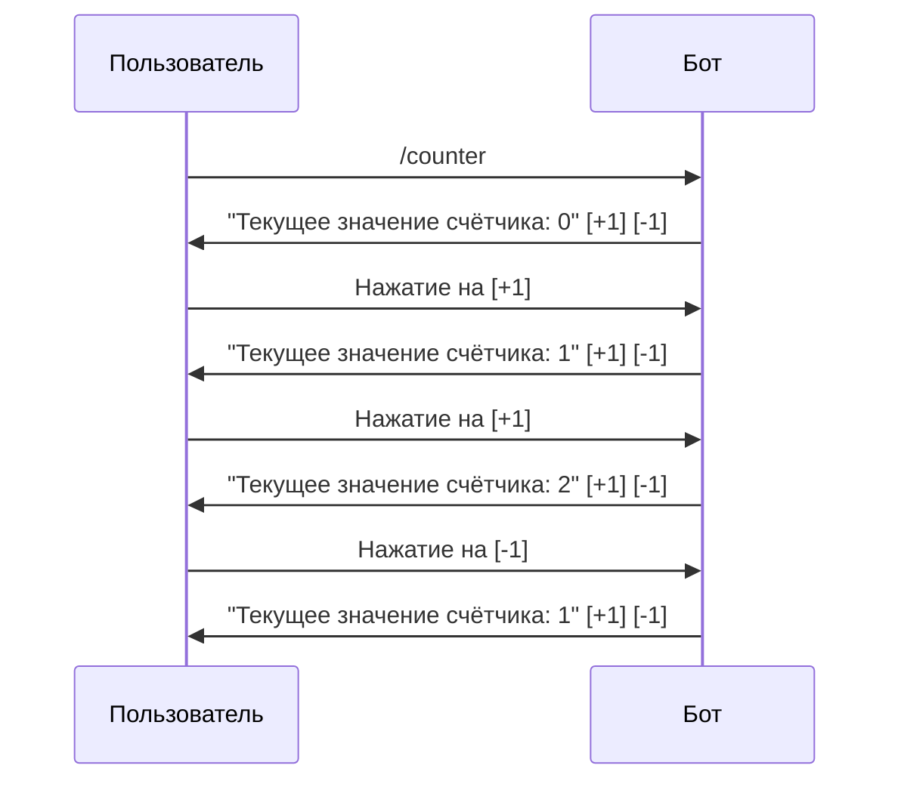

# Редактирование сообщений

В этом разделе описаны способы редактирования сообщений в pybotx.

## Введение

pybotx позволяет редактировать ранее отправленные сообщения с помощью метода `bot.edit_message()`. Это полезно для создания интерактивных элементов, таких как счётчики, опросы, прогресс-бары и другие динамические компоненты.

Для редактирования сообщения необходимо знать его уникальный идентификатор (`sync_id`), который возвращается при отправке сообщения.

## Метод редактирования сообщений

Метод `bot.edit_message()` используется для редактирования ранее отправленных сообщений:

```python
async def edit_message(
    self,
    *,
    bot_id: UUID,
    sync_id: UUID,
    body: Missing[str] = Undefined,
    metadata: Missing[Dict[str, Any]] = Undefined,
    bubbles: Missing[BubbleMarkup] = Undefined,
    keyboard: Missing[KeyboardMarkup] = Undefined,
    file: MissingOptionalAttachment = Undefined,
    markup_auto_adjust: Missing[bool] = Undefined,
) -> None:
    # ...
```

Параметры метода:
- `bot_id` — ID бота, от имени которого было отправлено сообщение
- `sync_id` — уникальный идентификатор сообщения, которое нужно отредактировать
- `body` — новый текст сообщения (если не указан, текст не изменится)
- `metadata` — новые метаданные сообщения (если не указаны, метаданные не изменятся)
- `bubbles` — новые кнопки под сообщением (если не указаны, кнопки не изменятся)
- `keyboard` — новые кнопки в поле ввода (если не указаны, кнопки не изменятся)
- `file` — новый файл (если не указан, файл не изменится)
- `markup_auto_adjust` — автоматически настроить расположение кнопок

> **Note**
> 
> Метод `bot.edit_message()` не возвращает новый `sync_id`. Идентификатор сообщения остаётся прежним после редактирования.

## Получение sync_id сообщения

Существует несколько способов получить `sync_id` сообщения:

1. **При отправке сообщения** — методы `bot.answer_message()` и `bot.send_message()` возвращают `sync_id`:

```python
sync_id = await bot.answer_message("Исходное сообщение")
```

2. **Из нажатия на кнопку** — когда пользователь нажимает на кнопку, в объекте `message` доступен атрибут `source_sync_id`, который содержит `sync_id` сообщения, в котором была нажата кнопка:

```python
@collector.command("/button")
async def button_handler(message: IncomingMessage, bot: Bot) -> None:
    if message.source_sync_id:
        # Пользователь нажал на кнопку
        await bot.edit_message(
            bot_id=message.bot.id,
            sync_id=message.source_sync_id,
            body="Сообщение отредактировано!",
        )
    else:
        # Первичный вызов команды
        bubbles = BubbleMarkup()
        bubbles.add_button(
            command="/button",
            label="Редактировать",
        )
        await bot.answer_message("Нажмите на кнопку для редактирования", bubbles=bubbles)
```

## Пример редактирования счётчика

Один из популярных примеров использования редактирования сообщений — создание счётчика с кнопками для увеличения и уменьшения значения:

```python
from pybotx import HandlerCollector, IncomingMessage, Bot, BubbleMarkup

collector = HandlerCollector()

@collector.command("/counter", description="Счётчик с кнопками +/-")
async def counter_handler(message: IncomingMessage, bot: Bot) -> None:
    # Получаем текущее значение счётчика из данных кнопки или устанавливаем начальное значение
    if message.source_sync_id and "value" in message.data:
        current_value = message.data["value"]
    else:
        current_value = 0
    
    # Создаем кнопки для увеличения и уменьшения счётчика
    bubbles = BubbleMarkup()
    
    # Кнопка "-1"
    bubbles.add_button(
        command="/counter",
        label="-1",
        data={"value": current_value - 1},
        background_color="#dc3545",
    )
    
    # Кнопка "+1"
    bubbles.add_button(
        command="/counter",
        label="+1",
        data={"value": current_value + 1},
        background_color="#28a745",
        new_row=False,  # Кнопка будет в том же ряду
    )
    
    # Формируем текст сообщения
    message_text = f"Текущее значение счётчика: {current_value}"
    
    if message.source_sync_id:
        # Если это нажатие на кнопку, редактируем существующее сообщение
        await bot.edit_message(
            bot_id=message.bot.id,
            sync_id=message.source_sync_id,
            body=message_text,
            bubbles=bubbles,
        )
    else:
        # Если это первичный вызов команды, отправляем новое сообщение
        await bot.answer_message(
            message_text,
            bubbles=bubbles,
        )
```

В этом примере:
1. Когда пользователь вызывает команду `/counter`, бот отправляет сообщение с текущим значением счётчика (0) и кнопками "+1" и "-1".
2. При нажатии на кнопку "+1" или "-1", бот получает сообщение с `source_sync_id` и данными кнопки (`message.data["value"]`).
3. Бот редактирует исходное сообщение, обновляя значение счётчика и сохраняя кнопки.
4. Пользователь может продолжать нажимать на кнопки, и сообщение будет обновляться.



## Примеры использования

### Редактирование текста сообщения

```python
from pybotx import HandlerCollector, IncomingMessage, Bot

collector = HandlerCollector()

@collector.command("/edit", description="Редактировать сообщение")
async def edit_handler(message: IncomingMessage, bot: Bot) -> None:
    # Отправляем исходное сообщение и сохраняем его sync_id
    sync_id = await bot.answer_message("Исходное сообщение")
    
    # Редактируем сообщение через 2 секунды
    import asyncio
    await asyncio.sleep(2)
    
    await bot.edit_message(
        bot_id=message.bot.id,
        sync_id=sync_id,
        body="Сообщение отредактировано!",
    )
```

### Прогресс-бар

```python
from pybotx import HandlerCollector, IncomingMessage, Bot
import asyncio

collector = HandlerCollector()

@collector.command("/progress", description="Показать прогресс-бар")
async def progress_handler(message: IncomingMessage, bot: Bot) -> None:
    # Отправляем начальное сообщение с прогресс-баром
    sync_id = await bot.answer_message("Прогресс: [          ] 0%")
    
    # Обновляем прогресс-бар каждую секунду
    for i in range(1, 11):
        await asyncio.sleep(1)
        
        # Вычисляем прогресс
        progress = i * 10
        bar = "=" * i + " " * (10 - i)
        
        # Редактируем сообщение с обновленным прогресс-баром
        await bot.edit_message(
            bot_id=message.bot.id,
            sync_id=sync_id,
            body=f"Прогресс: [{bar}] {progress}%",
        )
    
    # Финальное сообщение
    await bot.edit_message(
        bot_id=message.bot.id,
        sync_id=sync_id,
        body="Прогресс: [==========] 100%\nЗавершено!",
    )
```

### Опрос с подсчетом голосов

```python
from pybotx import HandlerCollector, IncomingMessage, Bot, BubbleMarkup
from collections import defaultdict

collector = HandlerCollector()

# Хранилище голосов (в реальном приложении лучше использовать базу данных)
polls = {}

@collector.command("/poll", description="Создать опрос")
async def poll_handler(message: IncomingMessage, bot: Bot) -> None:
    if not message.argument:
        await bot.answer_message("Пожалуйста, укажите вопрос для опроса")
        return
    
    question = message.argument
    
    if message.source_sync_id and message.source_sync_id in polls:
        # Пользователь проголосовал
        poll_data = polls[message.source_sync_id]
        option = message.data.get("option")
        
        # Добавляем голос
        if option is not None:
            # Если пользователь уже голосовал, удаляем его предыдущий голос
            for opt in poll_data["votes"]:
                if message.sender.huid in poll_data["votes"][opt]:
                    poll_data["votes"][opt].remove(message.sender.huid)
            
            # Добавляем новый голос
            poll_data["votes"][option].append(message.sender.huid)
        
        # Формируем обновленное сообщение с результатами
        body = f"Опрос: {poll_data['question']}\n\n"
        
        for i, option in enumerate(poll_data["options"]):
            votes = len(poll_data["votes"][i])
            total_votes = sum(len(voters) for voters in poll_data["votes"].values())
            percentage = (votes / total_votes * 100) if total_votes > 0 else 0
            
            body += f"{option}: {votes} голосов ({percentage:.1f}%)\n"
        
        body += f"\nВсего голосов: {total_votes}"
        
        # Редактируем сообщение с обновленными результатами
        await bot.edit_message(
            bot_id=message.bot.id,
            sync_id=message.source_sync_id,
            body=body,
            bubbles=poll_data["bubbles"],
        )
    else:
        # Создаем новый опрос
        options = ["Да", "Нет", "Воздержусь"]
        
        # Создаем кнопки для голосования
        bubbles = BubbleMarkup()
        for i, option in enumerate(options):
            bubbles.add_button(
                command="/poll",
                label=option,
                data={"option": i},
                background_color="#007bff",
                new_row=i > 0,  # Каждая кнопка в новом ряду
            )
        
        # Отправляем сообщение с опросом
        sync_id = await bot.answer_message(
            f"Опрос: {question}\n\nДа: 0 голосов (0.0%)\nНет: 0 голосов (0.0%)\nВоздержусь: 0 голосов (0.0%)\n\nВсего голосов: 0",
            bubbles=bubbles,
        )
        
        # Сохраняем данные опроса
        polls[sync_id] = {
            "question": question,
            "options": options,
            "votes": defaultdict(list),
            "bubbles": bubbles,
        }
```

## См. также

- [Отправка сообщений](sending.md)
- [Удаление сообщений](deleting.md)
- [Кнопки и разметка](bubbles.md)
- [Упоминания](mentions.md)
- [Вложения](attachments.md)