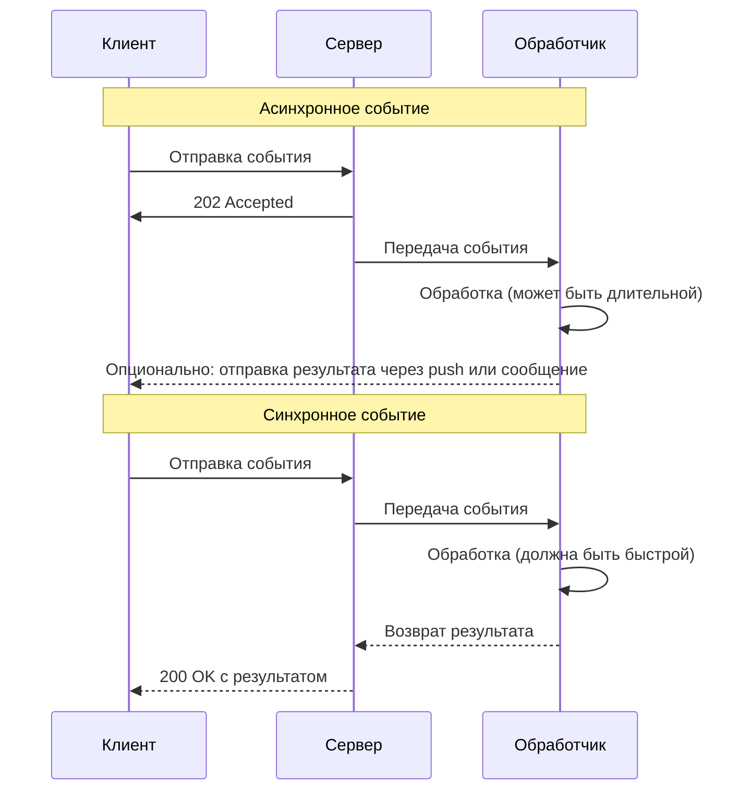

# Обзор SmartApp

В этом разделе описаны основные концепции SmartApp в pybotx.


## Введение

SmartApp — это интерактивные приложения, которые работают внутри мессенджера eXpress. Они позволяют создавать сложные пользовательские интерфейсы и взаимодействовать с пользователями в более богатом формате, чем обычные чат-боты.

pybotx предоставляет инструменты для обработки событий SmartApp, которые могут быть как асинхронными, так и синхронными. Выбор между этими двумя типами событий зависит от конкретного сценария использования.

## Асинхронные vs Синхронные SmartApp события

В pybotx существует два типа обработчиков событий SmartApp:

1. **Асинхронные события** (`@collector.smartapp_event`) — обрабатываются асинхронно, без ожидания ответа от обработчика. Клиент не ждет завершения обработки события.

2. **Синхронные события** (`@collector.sync_smartapp_event`) — обрабатываются синхронно, с ожиданием ответа от обработчика. Клиент ждет завершения обработки события и получает результат.

### Асинхронные события

Асинхронные события используются, когда:
- Не требуется немедленный ответ пользователю
- Обработка может занять длительное время
- Результат обработки будет отправлен позже через push-уведомление или сообщение в чат

```python
from pybotx import Bot, HandlerCollector, SmartAppEvent

collector = HandlerCollector()

@collector.smartapp_event
async def handle_smartapp_event(event: SmartAppEvent, bot: Bot) -> None:
    # Получаем данные из события
    data = event.data

    # Выполняем длительную операцию
    result = await some_long_operation(data)

    # Отправляем результат в чат
    await bot.send_message(
        bot_id=event.bot.id,
        chat_id=event.chat.id,
        body=f"Результат обработки: {result}",
    )
```

Асинхронные события обрабатываются через эндпоинт `/command`.

### Синхронные события

Синхронные события используются, когда:
- Требуется немедленный ответ пользователю
- Обработка выполняется быстро
- Результат обработки должен быть возвращен клиенту сразу

```python
from pybotx import (
    Bot, HandlerCollector, SmartAppEvent,
    BotAPISyncSmartAppEventResultResponse
)

collector = HandlerCollector()

@collector.sync_smartapp_event
async def handle_sync_smartapp_event(
    event: SmartAppEvent, bot: Bot
) -> BotAPISyncSmartAppEventResultResponse:
    # Получаем данные из события
    data = event.data

    # Выполняем быструю операцию
    result = process_data(data)

    # Возвращаем результат клиенту
    return BotAPISyncSmartAppEventResultResponse.from_domain(
        data={"result": result},
        files=[],
    )
```

Синхронные события обрабатываются через эндпоинт `/smartapps/request`.

### Сравнение асинхронных и синхронных событий



> **Note**
> 
> Синхронные события имеют ограничение по времени обработки (обычно 30 секунд), после которого клиент может прервать соединение. Поэтому для длительных операций рекомендуется использовать асинхронные события.

## Жизненный цикл SmartApp

Жизненный цикл SmartApp включает следующие этапы:

1. **Открытие SmartApp** — пользователь открывает SmartApp, что генерирует событие с типом `smartapp.open`
2. **Взаимодействие с SmartApp** — пользователь взаимодействует с интерфейсом SmartApp, что генерирует события с пользовательскими типами
3. **Закрытие SmartApp** — пользователь закрывает SmartApp, что генерирует событие с типом `smartapp.close`

Каждое событие содержит:
- Тип события (`event.type`)
- Данные события (`event.data`)
- Информацию о пользователе (`event.sender`)
- Информацию о чате (`event.chat`)
- Информацию о боте (`event.bot`)

## Лучшие практики

### 1. Выбор правильного типа обработчика

- Используйте **асинхронные события** для:
  - Длительных операций (более 5 секунд)
  - Фоновых задач
  - Операций, не требующих немедленного ответа

- Используйте **синхронные события** для:
  - Быстрых операций (менее 5 секунд)
  - Операций, требующих немедленного ответа
  - Валидации данных
  - Получения данных для отображения в интерфейсе

### 2. Обработка ошибок

Всегда обрабатывайте исключения в обработчиках событий:

```python
@collector.sync_smartapp_event
async def handle_sync_smartapp_event(
    event: SmartAppEvent, bot: Bot
) -> BotAPISyncSmartAppEventResultResponse:
    try:
        # Обработка события
        result = process_data(event.data)

        return BotAPISyncSmartAppEventResultResponse.from_domain(
            data={"result": result, "success": True},
            files=[],
        )
    except Exception as e:
        # Логирование ошибки
        logger.exception(f"Error processing event: {e}")

        # Возвращаем информацию об ошибке клиенту
        return BotAPISyncSmartAppEventResultResponse.from_domain(
            data={"error": str(e), "success": False},
            files=[],
        )
```

### 3. Структурирование кода

Разделяйте логику обработки событий и бизнес-логику:

```python
# handlers.py
@collector.sync_smartapp_event
async def handle_sync_smartapp_event(
    event: SmartAppEvent, bot: Bot
) -> BotAPISyncSmartAppEventResultResponse:
    # Извлекаем данные из события
    event_type = event.type
    event_data = event.data

    # Вызываем соответствующий обработчик бизнес-логики
    if event_type == "get_user_data":
        result = await business_logic.get_user_data(event_data["user_id"])
    elif event_type == "update_user_data":
        result = await business_logic.update_user_data(event_data["user_id"], event_data["data"])
    else:
        result = {"error": f"Unknown event type: {event_type}"}

    # Возвращаем результат
    return BotAPISyncSmartAppEventResultResponse.from_domain(
        data=result,
        files=[],
    )

# business_logic.py
async def get_user_data(user_id: str) -> Dict[str, Any]:
    # Реализация бизнес-логики
    ...

async def update_user_data(user_id: str, data: Dict[str, Any]) -> Dict[str, Any]:
    # Реализация бизнес-логики
    ...
```

### 4. Использование типизации

Используйте типизацию для данных событий:

```python
from typing import Dict, List, Optional, TypedDict, Union
from pydantic import BaseModel

# Определение типов данных для событий
class UserData(BaseModel):
    id: str
    name: str
    email: Optional[str] = None
    role: str = "user"

class GetUserDataEvent(TypedDict):
    user_id: str

class UpdateUserDataEvent(TypedDict):
    user_id: str
    data: Dict[str, Union[str, int, bool, None]]

# Использование в обработчике
@collector.sync_smartapp_event
async def handle_sync_smartapp_event(
    event: SmartAppEvent, bot: Bot
) -> BotAPISyncSmartAppEventResultResponse:
    if event.type == "get_user_data":
        # Валидация данных события
        try:
            event_data = GetUserDataEvent(event.data)
        except (TypeError, ValueError) as e:
            return BotAPISyncSmartAppEventResultResponse.from_domain(
                data={"error": f"Invalid event data: {e}"},
                files=[],
            )

        # Обработка события
        user_data = await get_user_data(event_data["user_id"])

        return BotAPISyncSmartAppEventResultResponse.from_domain(
            data={"user": user_data},
            files=[],
        )

    # Обработка других типов событий
    ...
```

### 5. Оптимизация производительности

- Используйте кэширование для часто запрашиваемых данных
- Минимизируйте количество обращений к внешним API
- Используйте пулы соединений для баз данных
- Ограничивайте размер ответов

```python
from functools import lru_cache

# Кэширование часто запрашиваемых данных
@lru_cache(maxsize=100)
async def get_cached_user_data(user_id: str) -> Dict[str, Any]:
    # Получение данных из базы данных или внешнего API
    ...
    return user_data

@collector.sync_smartapp_event
async def handle_sync_smartapp_event(
    event: SmartAppEvent, bot: Bot
) -> BotAPISyncSmartAppEventResultResponse:
    if event.type == "get_user_data":
        user_id = event.data["user_id"]

        # Использование кэшированных данных
        user_data = await get_cached_user_data(user_id)

        return BotAPISyncSmartAppEventResultResponse.from_domain(
            data={"user": user_data},
            files=[],
        )

    # Обработка других типов событий
    ...
```

## Примеры использования

### Пример асинхронного обработчика

```python
from pybotx import Bot, HandlerCollector, SmartAppEvent

collector = HandlerCollector()

@collector.smartapp_event
async def handle_smartapp_event(event: SmartAppEvent, bot: Bot) -> None:
    # Обработка события открытия SmartApp
    if event.type == "smartapp.open":
        # Отправляем приветственное сообщение
        await bot.send_message(
            bot_id=event.bot.id,
            chat_id=event.chat.id,
            body=f"Привет, {event.sender.username}! Вы открыли SmartApp.",
        )
        return

    # Обработка события закрытия SmartApp
    if event.type == "smartapp.close":
        # Отправляем прощальное сообщение
        await bot.send_message(
            bot_id=event.bot.id,
            chat_id=event.chat.id,
            body=f"До свидания, {event.sender.username}! Вы закрыли SmartApp.",
        )
        return

    # Обработка пользовательского события
    if event.type == "generate_report":
        # Получаем параметры отчета
        report_params = event.data.get("params", {})

        # Отправляем сообщение о начале генерации
        await bot.send_message(
            bot_id=event.bot.id,
            chat_id=event.chat.id,
            body="Начинаем генерацию отчета. Это может занять некоторое время...",
        )

        # Генерируем отчет (длительная операция)
        report_data = await generate_report(report_params)

        # Создаем файл отчета
        from io import BytesIO
        from pybotx import OutgoingAttachment

        report_file = BytesIO(report_data.encode("utf-8"))
        attachment = await OutgoingAttachment.from_sync_buffer(
            report_file,
            filename="report.txt",
        )

        # Отправляем отчет
        await bot.send_message(
            bot_id=event.bot.id,
            chat_id=event.chat.id,
            body="Отчет готов:",
            file=attachment,
        )
        return
```

### Пример синхронного обработчика

```python
from pybotx import (
    Bot, HandlerCollector, SmartAppEvent,
    BotAPISyncSmartAppEventResultResponse
)

collector = HandlerCollector()

@collector.sync_smartapp_event
async def handle_sync_smartapp_event(
    event: SmartAppEvent, bot: Bot
) -> BotAPISyncSmartAppEventResultResponse:
    # Обработка события получения данных пользователя
    if event.type == "get_user_data":
        user_id = event.data.get("user_id")

        if not user_id:
            return BotAPISyncSmartAppEventResultResponse.from_domain(
                data={"error": "User ID is required"},
                files=[],
            )

        # Получаем данные пользователя
        try:
            user_data = await get_user_data(user_id)

            return BotAPISyncSmartAppEventResultResponse.from_domain(
                data={"user": user_data, "success": True},
                files=[],
            )
        except Exception as e:
            return BotAPISyncSmartAppEventResultResponse.from_domain(
                data={"error": str(e), "success": False},
                files=[],
            )

    # Обработка события валидации формы
    if event.type == "validate_form":
        form_data = event.data.get("form", {})

        # Валидируем форму
        validation_errors = validate_form(form_data)

        if validation_errors:
            return BotAPISyncSmartAppEventResultResponse.from_domain(
                data={"errors": validation_errors, "valid": False},
                files=[],
            )

        return BotAPISyncSmartAppEventResultResponse.from_domain(
            data={"valid": True},
            files=[],
        )

    # Обработка неизвестного типа события
    return BotAPISyncSmartAppEventResultResponse.from_domain(
        data={"error": f"Unknown event type: {event.type}"},
        files=[],
    )
```

### Пример комбинированного подхода

```python
from pybotx import (
    Bot, HandlerCollector, SmartAppEvent,
    BotAPISyncSmartAppEventResultResponse
)

collector = HandlerCollector()

# Синхронный обработчик для быстрых операций
@collector.sync_smartapp_event
async def handle_sync_smartapp_event(
    event: SmartAppEvent, bot: Bot
) -> BotAPISyncSmartAppEventResultResponse:
    # Обработка события получения данных
    if event.type == "get_data":
        data = await get_cached_data()

        return BotAPISyncSmartAppEventResultResponse.from_domain(
            data={"data": data, "success": True},
            files=[],
        )

    # Обработка события запуска длительной операции
    if event.type == "start_long_operation":
        # Запускаем длительную операцию в фоне
        operation_id = start_background_task(event)

        return BotAPISyncSmartAppEventResultResponse.from_domain(
            data={"operation_id": operation_id, "status": "started"},
            files=[],
        )

    # Обработка неизвестного типа события
    return BotAPISyncSmartAppEventResultResponse.from_domain(
        data={"error": f"Unknown event type: {event.type}"},
        files=[],
    )

# Асинхронный обработчик для длительных операций
@collector.smartapp_event
async def handle_smartapp_event(event: SmartAppEvent, bot: Bot) -> None:
    # Обработка события получения результата длительной операции
    if event.type == "get_operation_result":
        operation_id = event.data.get("operation_id")

        if not operation_id:
            await bot.send_message(
                bot_id=event.bot.id,
                chat_id=event.chat.id,
                body="Ошибка: не указан ID операции",
            )
            return

        # Получаем результат операции
        result = await get_operation_result(operation_id)

        # Отправляем результат
        await bot.send_message(
            bot_id=event.bot.id,
            chat_id=event.chat.id,
            body=f"Результат операции {operation_id}: {result}",
        )
        return
```

## См. также

- [RPC в SmartApp](/smartapps/rpc/)
- [Push-уведомления](/smartapps/push/)
- [UI-компоненты](/smartapps/ui/)
- [Интеграция с FastAPI](/integration/fastapi/)
- [Обработка событий](/handlers/events/)
