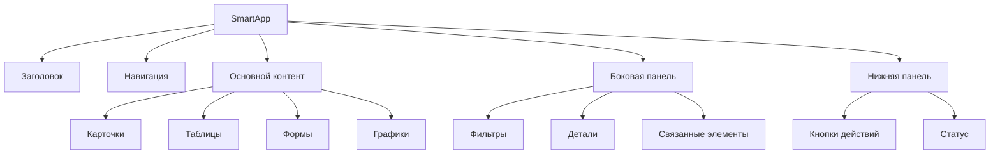

# UI-компоненты SmartApp

В этом разделе описаны Web-виджеты и UI-компоненты для создания интерфейса SmartApp, а также UX-советы для разработки.

## Введение

SmartApp в мессенджере eXpress представляет собой веб-приложение, которое отображается внутри мессенджера. Для создания интерфейса SmartApp можно использовать стандартные веб-технологии (HTML, CSS, JavaScript), а также специальные компоненты и виджеты, предоставляемые платформой.

Хороший пользовательский интерфейс и опыт взаимодействия (UX) критически важны для успеха SmartApp. В этом разделе мы рассмотрим основные компоненты и рекомендации по созданию эффективного интерфейса.

## Web-виджеты SmartApp

SmartApp поддерживает различные типы виджетов, которые можно использовать для создания интерфейса:

### Базовые компоненты

- **Кнопки** — для выполнения действий
- **Текстовые поля** — для ввода текста
- **Чекбоксы и радиокнопки** — для выбора опций
- **Выпадающие списки** — для выбора из нескольких вариантов
- **Таблицы** — для отображения структурированных данных
- **Карточки** — для группировки связанной информации
- **Вкладки** — для организации контента в разделы
- **Модальные окна** — для отображения дополнительной информации или форм

### Специальные компоненты

- **Селектор пользователей** — для выбора пользователей из списка контактов
- **Селектор чатов** — для выбора чатов
- **Загрузчик файлов** — для загрузки файлов
- **Просмотрщик документов** — для просмотра документов
- **Календарь** — для выбора даты и времени
- **Графики и диаграммы** — для визуализации данных

### Пример использования компонентов

```html
<!-- Пример формы с различными компонентами -->
<div class="form-container">
  <h2>Создание задачи</h2>
  
  <div class="form-group">
    <label for="task-title">Название задачи</label>
    <input type="text" id="task-title" class="form-control" placeholder="Введите название задачи">
  </div>
  
  <div class="form-group">
    <label for="task-description">Описание</label>
    <textarea id="task-description" class="form-control" rows="3" placeholder="Введите описание задачи"></textarea>
  </div>
  
  <div class="form-group">
    <label for="task-priority">Приоритет</label>
    <select id="task-priority" class="form-control">
      <option value="low">Низкий</option>
      <option value="medium" selected>Средний</option>
      <option value="high">Высокий</option>
    </select>
  </div>
  
  <div class="form-group">
    <label>Тип задачи</label>
    <div class="radio">
      <label>
        <input type="radio" name="task-type" value="feature" checked>
        Новая функция
      </label>
    </div>
    <div class="radio">
      <label>
        <input type="radio" name="task-type" value="bug">
        Исправление ошибки
      </label>
    </div>
    <div class="radio">
      <label>
        <input type="radio" name="task-type" value="improvement">
        Улучшение
      </label>
    </div>
  </div>
  
  <div class="form-group">
    <label>Дополнительные опции</label>
    <div class="checkbox">
      <label>
        <input type="checkbox" id="task-urgent">
        Срочная задача
      </label>
    </div>
    <div class="checkbox">
      <label>
        <input type="checkbox" id="task-notify">
        Уведомить участников
      </label>
    </div>
  </div>
  
  <div class="form-group">
    <label for="task-assignee">Исполнитель</label>
    <div id="user-selector" class="user-selector"></div>
  </div>
  
  <div class="form-group">
    <label for="task-deadline">Срок выполнения</label>
    <div id="date-picker" class="date-picker"></div>
  </div>
  
  <div class="form-group">
    <label for="task-attachments">Вложения</label>
    <div id="file-uploader" class="file-uploader"></div>
  </div>
  
  <div class="form-actions">
    <button type="button" class="btn btn-primary" id="save-task">Сохранить</button>
    <button type="button" class="btn btn-secondary" id="cancel-task">Отмена</button>
  </div>
</div>
```

## Структура интерфейса

При разработке интерфейса SmartApp рекомендуется придерживаться определенной структуры:

### Основные элементы интерфейса

1. **Заголовок** — отображает название SmartApp и основные действия
2. **Навигация** — позволяет переключаться между разделами
3. **Основной контент** — отображает основное содержимое раздела
4. **Боковая панель** — содержит дополнительную информацию или навигацию
5. **Нижняя панель** — содержит дополнительные действия или информацию



### Пример структуры интерфейса

```html
<div class="smartapp-container">
  <!-- Заголовок -->
  <header class="smartapp-header">
    <h1>Управление задачами</h1>
    <div class="header-actions">
      <button class="btn btn-primary">Создать задачу</button>
      <button class="btn btn-secondary">Настройки</button>
    </div>
  </header>
  
  <!-- Навигация -->
  <nav class="smartapp-nav">
    <ul>
      <li class="active"><a href="#tasks">Задачи</a></li>
      <li><a href="#projects">Проекты</a></li>
      <li><a href="#reports">Отчеты</a></li>
      <li><a href="#settings">Настройки</a></li>
    </ul>
  </nav>
  
  <!-- Основной контент и боковая панель -->
  <div class="smartapp-content">
    <!-- Основной контент -->
    <main class="main-content">
      <h2>Мои задачи</h2>
      
      <!-- Таблица задач -->
      <table class="tasks-table">
        <!-- Содержимое таблицы -->
      </table>
    </main>
    
    <!-- Боковая панель -->
    <aside class="sidebar">
      <h3>Фильтры</h3>
      <div class="filters">
        <!-- Фильтры -->
      </div>
      
      <h3>Статистика</h3>
      <div class="statistics">
        <!-- Статистика -->
      </div>
    </aside>
  </div>
  
  <!-- Нижняя панель -->
  <footer class="smartapp-footer">
    <div class="pagination">
      <!-- Пагинация -->
    </div>
    <div class="status">
      <span>Всего задач: 42</span>
    </div>
  </footer>
</div>
```

## UX-советы

### 1. Адаптация к контексту мессенджера

SmartApp работает внутри мессенджера, поэтому важно учитывать этот контекст:

- **Интеграция с чатами** — позволяйте пользователям легко делиться информацией из SmartApp в чатах
- **Компактность** — учитывайте, что SmartApp может отображаться в ограниченном пространстве
- **Согласованность с дизайном мессенджера** — следуйте общему стилю и UX-паттернам мессенджера

### 2. Отзывчивость и производительность

- **Быстрая загрузка** — оптимизируйте размер ресурсов и используйте ленивую загрузку
- **Мгновенная обратная связь** — показывайте индикаторы загрузки и анимации для длительных операций
- **Кэширование данных** — сохраняйте данные локально для быстрого доступа

```javascript
// Пример индикатора загрузки
function showLoading(isLoading) {
  const loadingElement = document.getElementById('loading');
  if (isLoading) {
    loadingElement.style.display = 'block';
  } else {
    loadingElement.style.display = 'none';
  }
}

// Пример кэширования данных
const dataCache = new Map();

async function fetchData(url) {
  // Проверяем, есть ли данные в кэше
  if (dataCache.has(url)) {
    return dataCache.get(url);
  }
  
  // Показываем индикатор загрузки
  showLoading(true);
  
  try {
    // Загружаем данные
    const response = await fetch(url);
    const data = await response.json();
    
    // Сохраняем в кэш
    dataCache.set(url, data);
    
    return data;
  } finally {
    // Скрываем индикатор загрузки
    showLoading(false);
  }
}
```

### 3. Понятный интерфейс

- **Ясные обозначения** — используйте понятные названия и иконки
- **Подсказки** — добавляйте всплывающие подсказки для сложных элементов
- **Прогрессивное раскрытие** — показывайте сначала основные функции, а затем дополнительные
- **Группировка связанных элементов** — объединяйте связанные элементы визуально

### 4. Обработка ошибок

- **Понятные сообщения об ошибках** — объясняйте, что пошло не так и как это исправить
- **Восстановление после ошибок** — предлагайте способы восстановления или альтернативные действия
- **Предотвращение ошибок** — валидируйте данные до отправки и предлагайте корректные значения

```javascript
// Пример валидации формы
function validateForm() {
  const titleInput = document.getElementById('task-title');
  const titleError = document.getElementById('task-title-error');
  
  // Проверяем, что поле не пустое
  if (!titleInput.value.trim()) {
    titleError.textContent = 'Название задачи обязательно';
    titleError.style.display = 'block';
    titleInput.classList.add('error');
    return false;
  }
  
  // Проверяем длину
  if (titleInput.value.length > 100) {
    titleError.textContent = 'Название задачи не должно превышать 100 символов';
    titleError.style.display = 'block';
    titleInput.classList.add('error');
    return false;
  }
  
  // Если всё в порядке, скрываем ошибку
  titleError.style.display = 'none';
  titleInput.classList.remove('error');
  return true;
}
```

### 5. Доступность

- **Контрастные цвета** — обеспечивайте достаточный контраст между текстом и фоном
- **Альтернативный текст** — добавляйте alt-текст для изображений
- **Клавиатурная навигация** — обеспечивайте возможность навигации с клавиатуры
- **Семантическая разметка** — используйте правильные HTML-элементы для их предназначения

### 6. Мобильная адаптация

- **Отзывчивый дизайн** — адаптируйте интерфейс к различным размерам экрана
- **Touch-friendly** — делайте элементы управления достаточно большими для тапа пальцем
- **Жесты** — поддерживайте стандартные жесты (свайп, пинч и т.д.)

```css
/* Пример адаптивного дизайна */
.smartapp-container {
  display: flex;
  flex-direction: column;
}

.smartapp-content {
  display: flex;
  flex-direction: row;
}

.main-content {
  flex: 3;
  padding: 16px;
}

.sidebar {
  flex: 1;
  padding: 16px;
  background-color: #f5f5f5;
}

/* Адаптация для мобильных устройств */
@media (max-width: 768px) {
  .smartapp-content {
    flex-direction: column;
  }
  
  .sidebar {
    margin-top: 16px;
  }
  
  .btn {
    padding: 12px 16px; /* Увеличиваем размер кнопок для тапа */
  }
}
```

### 7. Персонализация

- **Сохранение предпочтений** — запоминайте настройки пользователя
- **Адаптация к поведению** — показывайте релевантный контент на основе предыдущих действий
- **Темная тема** — поддерживайте светлую и темную темы

```javascript
// Пример сохранения и применения темы
function setTheme(theme) {
  document.body.classList.remove('theme-light', 'theme-dark');
  document.body.classList.add(`theme-${theme}`);
  localStorage.setItem('theme', theme);
}

function loadTheme() {
  const savedTheme = localStorage.getItem('theme') || 'light';
  setTheme(savedTheme);
}

// Загружаем тему при запуске
document.addEventListener('DOMContentLoaded', loadTheme);

// Обработчик переключения темы
document.getElementById('theme-toggle').addEventListener('click', () => {
  const currentTheme = localStorage.getItem('theme') || 'light';
  const newTheme = currentTheme === 'light' ? 'dark' : 'light';
  setTheme(newTheme);
});
```

## Примеры использования

### Пример 1: Простой список задач

```html
<!DOCTYPE html>
<html lang="ru">
<head>
  <meta charset="UTF-8">
  <meta name="viewport" content="width=device-width, initial-scale=1.0">
  <title>Список задач</title>
  <style>
    body {
      font-family: Arial, sans-serif;
      margin: 0;
      padding: 0;
      background-color: #f5f5f5;
    }
    
    .container {
      max-width: 800px;
      margin: 0 auto;
      padding: 16px;
    }
    
    .header {
      display: flex;
      justify-content: space-between;
      align-items: center;
      margin-bottom: 24px;
    }
    
    .task-list {
      background-color: #fff;
      border-radius: 8px;
      box-shadow: 0 2px 4px rgba(0, 0, 0, 0.1);
      overflow: hidden;
    }
    
    .task-item {
      display: flex;
      align-items: center;
      padding: 12px 16px;
      border-bottom: 1px solid #eee;
    }
    
    .task-item:last-child {
      border-bottom: none;
    }
    
    .task-checkbox {
      margin-right: 12px;
    }
    
    .task-title {
      flex: 1;
    }
    
    .task-item.completed .task-title {
      text-decoration: line-through;
      color: #888;
    }
    
    .task-actions {
      display: flex;
    }
    
    .task-actions button {
      background: none;
      border: none;
      cursor: pointer;
      color: #666;
      margin-left: 8px;
    }
    
    .add-task {
      display: flex;
      margin-top: 16px;
    }
    
    .add-task input {
      flex: 1;
      padding: 8px 12px;
      border: 1px solid #ddd;
      border-radius: 4px 0 0 4px;
    }
    
    .add-task button {
      padding: 8px 16px;
      background-color: #4CAF50;
      color: white;
      border: none;
      border-radius: 0 4px 4px 0;
      cursor: pointer;
    }
  </style>
</head>
<body>
  <div class="container">
    <div class="header">
      <h1>Список задач</h1>
      <div>
        <button id="clear-completed">Очистить завершенные</button>
      </div>
    </div>
    
    <div class="task-list" id="task-list">
      <!-- Задачи будут добавлены с помощью JavaScript -->
    </div>
    
    <div class="add-task">
      <input type="text" id="new-task" placeholder="Добавить новую задачу">
      <button id="add-task">Добавить</button>
    </div>
  </div>
  
  <script>
    // Начальные задачи
    let tasks = [
      { id: 1, title: "Изучить SmartApp API", completed: false },
      { id: 2, title: "Создать прототип интерфейса", completed: true },
      { id: 3, title: "Написать документацию", completed: false }
    ];
    
    // Функция для отображения задач
    function renderTasks() {
      const taskList = document.getElementById('task-list');
      taskList.innerHTML = '';
      
      tasks.forEach(task => {
        const taskItem = document.createElement('div');
        taskItem.className = `task-item ${task.completed ? 'completed' : ''}`;
        
        taskItem.innerHTML = `
          <input type="checkbox" class="task-checkbox" ${task.completed ? 'checked' : ''} data-id="${task.id}">
          <span class="task-title">${task.title}</span>
          <div class="task-actions">
            <button class="task-delete" data-id="${task.id}">Удалить</button>
          </div>
        `;
        
        taskList.appendChild(taskItem);
      });
      
      // Добавляем обработчики событий
      document.querySelectorAll('.task-checkbox').forEach(checkbox => {
        checkbox.addEventListener('change', toggleTask);
      });
      
      document.querySelectorAll('.task-delete').forEach(button => {
        button.addEventListener('click', deleteTask);
      });
    }
    
    // Функция для переключения статуса задачи
    function toggleTask(event) {
      const taskId = parseInt(event.target.dataset.id);
      const task = tasks.find(t => t.id === taskId);
      if (task) {
        task.completed = !task.completed;
        renderTasks();
      }
    }
    
    // Функция для удаления задачи
    function deleteTask(event) {
      const taskId = parseInt(event.target.dataset.id);
      tasks = tasks.filter(t => t.id !== taskId);
      renderTasks();
    }
    
    // Функция для добавления новой задачи
    function addTask() {
      const input = document.getElementById('new-task');
      const title = input.value.trim();
      
      if (title) {
        const newId = tasks.length > 0 ? Math.max(...tasks.map(t => t.id)) + 1 : 1;
        tasks.push({ id: newId, title, completed: false });
        input.value = '';
        renderTasks();
      }
    }
    
    // Функция для очистки завершенных задач
    function clearCompleted() {
      tasks = tasks.filter(t => !t.completed);
      renderTasks();
    }
    
    // Инициализация
    document.addEventListener('DOMContentLoaded', () => {
      renderTasks();
      
      document.getElementById('add-task').addEventListener('click', addTask);
      document.getElementById('new-task').addEventListener('keypress', event => {
        if (event.key === 'Enter') {
          addTask();
        }
      });
      
      document.getElementById('clear-completed').addEventListener('click', clearCompleted);
    });
  </script>
</body>
</html>
```

### Пример 2: Интеграция с RPC

```html
<!DOCTYPE html>
<html lang="ru">
<head>
  <meta charset="UTF-8">
  <meta name="viewport" content="width=device-width, initial-scale=1.0">
  <title>Управление задачами</title>
  <style>
    /* Стили опущены для краткости */
  </style>
</head>
<body>
  <div class="container">
    <div class="header">
      <h1>Управление задачами</h1>
      <div>
        <button id="refresh-tasks">Обновить</button>
        <button id="create-task">Создать задачу</button>
      </div>
    </div>
    
    <div class="task-list" id="task-list">
      <!-- Задачи будут загружены с сервера -->
      <div class="loading" id="loading">Загрузка...</div>
    </div>
    
    <!-- Модальное окно для создания задачи -->
    <div class="modal" id="task-modal">
      <div class="modal-content">
        <div class="modal-header">
          <h2>Новая задача</h2>
          <button class="close-modal">&times;</button>
        </div>
        <div class="modal-body">
          <form id="task-form">
            <div class="form-group">
              <label for="task-title">Название</label>
              <input type="text" id="task-title" required>
            </div>
            <div class="form-group">
              <label for="task-description">Описание</label>
              <textarea id="task-description"></textarea>
            </div>
            <div class="form-group">
              <label for="task-assignee">Исполнитель</label>
              <div id="user-selector"></div>
            </div>
            <div class="form-actions">
              <button type="submit" class="btn-primary">Сохранить</button>
              <button type="button" class="btn-secondary close-modal">Отмена</button>
            </div>
          </form>
        </div>
      </div>
    </div>
  </div>
  
  <script>
    // Класс для работы с RPC
    class SmartAppRPC {
      constructor() {
        this.pushHandlers = new Map();
        this.initMessageListener();
      }
      
      initMessageListener() {
        window.addEventListener('message', event => {
          const { data } = event;
          if (data && data.type === 'smartapp_rpc_push') {
            this.handlePush(data.method, data.params);
          }
        });
      }
      
      async call(method, params) {
        return new Promise((resolve, reject) => {
          const requestId = Date.now().toString();
          
          // Обработчик ответа
          const responseHandler = event => {
            const { data } = event;
            if (data && data.type === 'smartapp_rpc_response' && data.request_id === requestId) {
              window.removeEventListener('message', responseHandler);
              
              if (data.error) {
                reject(new Error(data.error.message));
              } else {
                resolve(data.result);
              }
            }
          };
          
          window.addEventListener('message', responseHandler);
          
          // Отправка запроса
          window.parent.postMessage({
            type: 'smartapp_rpc_request',
            request_id: requestId,
            method,
            params
          }, '*');
          
          // Таймаут
          setTimeout(() => {
            window.removeEventListener('message', responseHandler);
            reject(new Error('RPC request timeout'));
          }, 10000);
        });
      }
      
      onPush(method, handler) {
        this.pushHandlers.set(method, handler);
      }
      
      handlePush(method, params) {
        const handler = this.pushHandlers.get(method);
        if (handler) {
          handler(params);
        }
      }
    }
    
    // Создаем экземпляр RPC-клиента
    const rpc = new SmartAppRPC();
    
    // Функция для загрузки задач
    async function loadTasks() {
      showLoading(true);
      
      try {
        const tasks = await rpc.call('get_tasks', {});
        renderTasks(tasks);
      } catch (error) {
        showError('Не удалось загрузить задачи: ' + error.message);
      } finally {
        showLoading(false);
      }
    }
    
    // Функция для создания задачи
    async function createTask(taskData) {
      showLoading(true);
      
      try {
        const result = await rpc.call('create_task', taskData);
        hideModal();
        loadTasks();
        showSuccess('Задача успешно создана');
      } catch (error) {
        showError('Не удалось создать задачу: ' + error.message);
      } finally {
        showLoading(false);
      }
    }
    
    // Функция для обновления статуса задачи
    async function updateTaskStatus(taskId, status) {
      showLoading(true);
      
      try {
        await rpc.call('update_task_status', { task_id: taskId, status });
        loadTasks();
      } catch (error) {
        showError('Не удалось обновить статус задачи: ' + error.message);
      } finally {
        showLoading(false);
      }
    }
    
    // Функция для отображения задач
    function renderTasks(tasks) {
      const taskList = document.getElementById('task-list');
      taskList.innerHTML = '';
      
      if (tasks.length === 0) {
        taskList.innerHTML = '<div class="empty-state">Нет задач</div>';
        return;
      }
      
      tasks.forEach(task => {
        const taskItem = document.createElement('div');
        taskItem.className = `task-item status-${task.status}`;
        
        taskItem.innerHTML = `
          <div class="task-header">
            <h3 class="task-title">${task.title}</h3>
            <div class="task-status">${getStatusLabel(task.status)}</div>
          </div>
          <div class="task-description">${task.description || ''}</div>
          <div class="task-footer">
            <div class="task-assignee">Исполнитель: ${task.assignee_name || 'Не назначен'}</div>
            <div class="task-actions">
              ${task.status !== 'completed' ? `<button class="btn-complete" data-id="${task.id}">Завершить</button>` : ''}
              ${task.status === 'completed' ? `<button class="btn-reopen" data-id="${task.id}">Переоткрыть</button>` : ''}
            </div>
          </div>
        `;
        
        taskList.appendChild(taskItem);
      });
      
      // Добавляем обработчики событий
      document.querySelectorAll('.btn-complete').forEach(button => {
        button.addEventListener('click', event => {
          const taskId = event.target.dataset.id;
          updateTaskStatus(taskId, 'completed');
        });
      });
      
      document.querySelectorAll('.btn-reopen').forEach(button => {
        button.addEventListener('click', event => {
          const taskId = event.target.dataset.id;
          updateTaskStatus(taskId, 'in_progress');
        });
      });
    }
    
    // Вспомогательные функции
    function getStatusLabel(status) {
      const labels = {
        'new': 'Новая',
        'in_progress': 'В работе',
        'completed': 'Завершена'
      };
      return labels[status] || status;
    }
    
    function showLoading(isLoading) {
      const loadingElement = document.getElementById('loading');
      if (isLoading) {
        loadingElement.style.display = 'block';
      } else {
        loadingElement.style.display = 'none';
      }
    }
    
    function showModal() {
      document.getElementById('task-modal').style.display = 'flex';
    }
    
    function hideModal() {
      document.getElementById('task-modal').style.display = 'none';
      document.getElementById('task-form').reset();
    }
    
    function showError(message) {
      alert('Ошибка: ' + message);
    }
    
    function showSuccess(message) {
      alert('Успех: ' + message);
    }
    
    // Обработка push-уведомлений
    rpc.onPush('task_created', params => {
      loadTasks();
      showSuccess(`Создана новая задача: ${params.task.title}`);
    });
    
    rpc.onPush('task_updated', params => {
      loadTasks();
      showSuccess(`Обновлена задача: ${params.task.title}`);
    });
    
    // Инициализация
    document.addEventListener('DOMContentLoaded', () => {
      // Загружаем задачи
      loadTasks();
      
      // Обработчики кнопок
      document.getElementById('refresh-tasks').addEventListener('click', loadTasks);
      document.getElementById('create-task').addEventListener('click', showModal);
      
      // Обработчики модального окна
      document.querySelectorAll('.close-modal').forEach(element => {
        element.addEventListener('click', hideModal);
      });
      
      // Обработка формы
      document.getElementById('task-form').addEventListener('submit', event => {
        event.preventDefault();
        
        const title = document.getElementById('task-title').value.trim();
        const description = document.getElementById('task-description').value.trim();
        
        if (!title) {
          showError('Название задачи обязательно');
          return;
        }
        
        createTask({
          title,
          description,
          assignee_huid: null // В реальном приложении здесь был бы выбранный пользователь
        });
      });
    });
  </script>
</body>
</html>
```

## См. также

- [Обзор SmartApp](overview.md)
- [RPC в SmartApp](rpc.md)
- [Push-уведомления](push.md)
- [Интеграция с FastAPI](../integration/fastapi.md)
- [Отправка сообщений](../messages/sending.md)