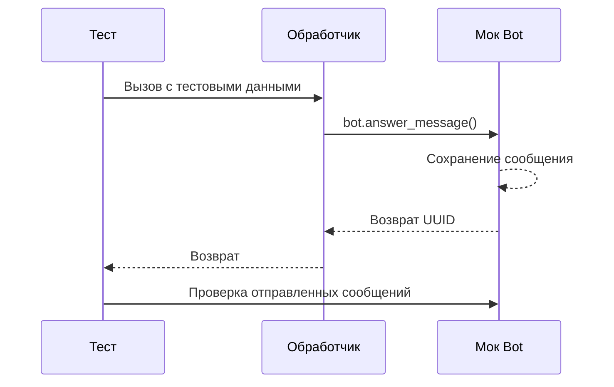

# Модульное тестирование

В этом разделе описаны подходы к модульному тестированию ботов, созданных с использованием pybotx, включая работу с pytest, фабриками тестовых данных, моком объекта Bot и проверкой отправленных сообщений.

## Введение

Модульное тестирование — важная часть разработки ботов на pybotx, которая позволяет:

- Убедиться, что обработчики команд работают корректно
- Проверить логику обработки сообщений
- Убедиться, что бот отправляет правильные ответы
- Выявить ошибки на ранних этапах разработки

В этом разделе мы рассмотрим, как настроить модульное тестирование для проектов на pybotx с использованием pytest, как создавать фабрики тестовых данных, как мокать объект Bot и как проверять отправленные сообщения.

## Настройка pytest

[pytest](https://docs.pytest.org/) — это фреймворк для написания и запуска тестов в Python. Для начала работы с pytest в проекте на pybotx, добавьте его в зависимости:

```bash
poetry add pytest pytest-asyncio pytest-cov --dev
```

Создайте файл `conftest.py` в корне проекта для настройки pytest:

```python
# conftest.py
import pytest
from uuid import UUID

from pybotx import Bot, BotAccount, HandlerCollector


@pytest.fixture
def bot_id() -> UUID:
    """Фикстура, возвращающая ID бота для тестов."""
    return UUID("123e4567-e89b-12d3-a456-426655440000")


@pytest.fixture
def bot_account(bot_id: UUID) -> BotAccount:
    """Фикстура, возвращающая аккаунт бота для тестов."""
    return BotAccount(
        id=bot_id,
        cts_url="https://cts.example.com",
    )


@pytest.fixture
def collector() -> HandlerCollector:
    """Фикстура, возвращающая коллектор обработчиков для тестов."""
    return HandlerCollector()
```

## Фабрики тестовых данных

Фабрики тестовых данных — это классы или функции, которые создают объекты с тестовыми данными. Они помогают уменьшить дублирование кода в тестах и делают тесты более читаемыми.

Для проектов на pybotx рекомендуется создать фабрики для основных объектов, таких как `IncomingMessage`, `UserSender`, `Chat` и т.д.

```python
# factories.py
from uuid import UUID, uuid4
from typing import Dict, Any, Optional, List

from pybotx import (
    IncomingMessage, UserSender, Chat, Bot, BotAccount,
    ChatTypes, OutgoingMessage, BubbleMarkup, KeyboardMarkup,
)


class UserSenderFactory:
    """Фабрика для создания объектов UserSender."""
    
    @staticmethod
    def create(
        huid: Optional[UUID] = None,
        username: str = "Test User",
        ad_login: Optional[str] = None,
        ad_domain: Optional[str] = None,
        is_admin: bool = False,
        is_creator: bool = False,
    ) -> UserSender:
        """Создает объект UserSender с указанными параметрами."""
        return UserSender(
            huid=huid or uuid4(),
            username=username,
            ad_login=ad_login,
            ad_domain=ad_domain,
            is_admin=is_admin,
            is_creator=is_creator,
        )


class ChatFactory:
    """Фабрика для создания объектов Chat."""
    
    @staticmethod
    def create(
        chat_id: Optional[UUID] = None,
        name: str = "Test Chat",
        chat_type: ChatTypes = ChatTypes.GROUP_CHAT,
    ) -> Chat:
        """Создает объект Chat с указанными параметрами."""
        return Chat(
            id=chat_id or uuid4(),
            name=name,
            type=chat_type,
        )


class IncomingMessageFactory:
    """Фабрика для создания объектов IncomingMessage."""
    
    @staticmethod
    def create(
        bot_id: Optional[UUID] = None,
        chat: Optional[Chat] = None,
        sender: Optional[UserSender] = None,
        body: str = "Test message",
        command: Optional[str] = None,
        data: Optional[Dict[str, Any]] = None,
        metadata: Optional[Dict[str, Any]] = None,
        file: Optional[Any] = None,
        source_sync_id: Optional[UUID] = None,
    ) -> IncomingMessage:
        """Создает объект IncomingMessage с указанными параметрами."""
        if bot_id is None:
            bot_id = uuid4()
        
        if chat is None:
            chat = ChatFactory.create()
        
        if sender is None:
            sender = UserSenderFactory.create()
        
        # Создаем объект бота
        bot_account = BotAccount(
            id=bot_id,
            cts_url="https://cts.example.com",
        )
        
        return IncomingMessage(
            bot=bot_account,
            sync_id=uuid4(),
            source_sync_id=source_sync_id,
            body=body,
            command=command or "",
            data=data or {},
            metadata=metadata or {},
            file=file,
            sender=sender,
            chat=chat,
            raw_command=None,
        )
```

## Мок объекта Bot

Для тестирования обработчиков команд необходимо создать мок объекта `Bot`, который будет перехватывать вызовы методов и сохранять информацию о них для последующей проверки.

```python
# bot_mock.py
from typing import Dict, Any, List, Optional, Union
from uuid import UUID

from pybotx import (
    Bot, BotAccount, IncomingMessage, OutgoingMessage,
    BubbleMarkup, KeyboardMarkup, IncomingFileAttachment, OutgoingAttachment,
)
from pybotx.missing import Missing, Undefined


class MockBot(Bot):
    """Мок объекта Bot для тестирования."""
    
    def __init__(self, *args, **kwargs):
        super().__init__(*args, **kwargs)
        self.sent_messages: List[OutgoingMessage] = []
        self.answered_messages: List[OutgoingMessage] = []
        self.edited_messages: List[Dict[str, Any]] = []
        self.deleted_messages: List[Dict[str, Any]] = []
    
    async def send(self, message: OutgoingMessage) -> UUID:
        """Мок метода send."""
        self.sent_messages.append(message)
        return UUID("00000000-0000-0000-0000-000000000000")
    
    async def answer_message(
        self,
        body: str,
        *,
        metadata: Missing[Dict[str, Any]] = Undefined,
        bubbles: Missing[BubbleMarkup] = Undefined,
        keyboard: Missing[KeyboardMarkup] = Undefined,
        file: Missing[Union[IncomingFileAttachment, OutgoingAttachment]] = Undefined,
        recipients: Missing[List[UUID]] = Undefined,
        silent_response: Missing[bool] = Undefined,
        markup_auto_adjust: Missing[bool] = Undefined,
        stealth_mode: Missing[bool] = Undefined,
        send_push: Missing[bool] = Undefined,
        ignore_mute: Missing[bool] = Undefined,
        wait_callback: bool = True,
        callback_timeout: Optional[float] = None,
    ) -> UUID:
        """Мок метода answer_message."""
        # Создаем OutgoingMessage для сохранения
        message = OutgoingMessage(
            bot_id=self.bot_id,
            chat_id=self.current_chat_id,
            body=body,
            metadata=metadata if metadata is not Undefined else None,
            bubbles=bubbles if bubbles is not Undefined else None,
            keyboard=keyboard if keyboard is not Undefined else None,
            file=file if file is not Undefined else None,
            recipients=recipients if recipients is not Undefined else None,
            silent_response=silent_response if silent_response is not Undefined else None,
            markup_auto_adjust=markup_auto_adjust if markup_auto_adjust is not Undefined else None,
            stealth_mode=stealth_mode if stealth_mode is not Undefined else None,
            send_push=send_push if send_push is not Undefined else None,
            ignore_mute=ignore_mute if ignore_mute is not Undefined else None,
        )
        
        self.answered_messages.append(message)
        return UUID("00000000-0000-0000-0000-000000000000")
    
    async def edit_message(
        self,
        *,
        bot_id: UUID,
        sync_id: UUID,
        body: Missing[str] = Undefined,
        metadata: Missing[Dict[str, Any]] = Undefined,
        bubbles: Missing[BubbleMarkup] = Undefined,
        keyboard: Missing[KeyboardMarkup] = Undefined,
        file: Missing[Union[IncomingFileAttachment, OutgoingAttachment]] = Undefined,
        markup_auto_adjust: Missing[bool] = Undefined,
    ) -> None:
        """Мок метода edit_message."""
        self.edited_messages.append({
            "bot_id": bot_id,
            "sync_id": sync_id,
            "body": body if body is not Undefined else None,
            "metadata": metadata if metadata is not Undefined else None,
            "bubbles": bubbles if bubbles is not Undefined else None,
            "keyboard": keyboard if keyboard is not Undefined else None,
            "file": file if file is not Undefined else None,
            "markup_auto_adjust": markup_auto_adjust if markup_auto_adjust is not Undefined else None,
        })
    
    async def delete_message(
        self,
        *,
        bot_id: UUID,
        sync_id: UUID,
    ) -> None:
        """Мок метода delete_message."""
        self.deleted_messages.append({
            "bot_id": bot_id,
            "sync_id": sync_id,
        })
    
    def clear_sent_messages(self) -> None:
        """Очищает список отправленных сообщений."""
        self.sent_messages = []
        self.answered_messages = []
        self.edited_messages = []
        self.deleted_messages = []
```

Добавьте фикстуру для мока бота в `conftest.py`:

```python
# conftest.py
import pytest
from uuid import UUID

from pybotx import Bot, BotAccount, HandlerCollector

from .bot_mock import MockBot


@pytest.fixture
def mock_bot(bot_account: BotAccount, collector: HandlerCollector) -> MockBot:
    """Фикстура, возвращающая мок объекта Bot для тестов."""
    return MockBot(
        collectors=[collector],
        bot_accounts=[bot_account],
    )
```

## Проверка отправленных сообщений

После выполнения тестов можно проверить, какие сообщения были отправлены ботом:

```python
# test_handlers.py
import pytest
from uuid import UUID

from pybotx import IncomingMessage, Bot

from .factories import IncomingMessageFactory
from .bot_mock import MockBot


@pytest.mark.asyncio
async def test_echo_handler(mock_bot: MockBot, bot_id: UUID):
    """Тест обработчика команды /echo."""
    # Создаем входящее сообщение
    message = IncomingMessageFactory.create(
        bot_id=bot_id,
        body="/echo Hello, world!",
        command="/echo",
    )
    
    # Вызываем обработчик
    await echo_handler(message, mock_bot)
    
    # Проверяем, что бот отправил правильное сообщение
    assert len(mock_bot.answered_messages) == 1
    assert mock_bot.answered_messages[0].body == "Hello, world!"
```

## Тестирование обработчиков команд

Для тестирования обработчиков команд можно использовать следующий подход:

```python
# handlers.py
from pybotx import IncomingMessage, Bot, HandlerCollector

collector = HandlerCollector()

@collector.command("/echo", description="Отправить обратно полученный текст")
async def echo_handler(message: IncomingMessage, bot: Bot) -> None:
    await bot.answer_message(message.argument)

@collector.command("/greet", description="Поприветствовать пользователя")
async def greet_handler(message: IncomingMessage, bot: Bot) -> None:
    await bot.answer_message(f"Привет, {message.sender.username}!")
```

```python
# test_handlers.py
import pytest
from uuid import UUID

from pybotx import IncomingMessage

from .factories import IncomingMessageFactory
from .bot_mock import MockBot
from .handlers import echo_handler, greet_handler


@pytest.mark.asyncio
async def test_echo_handler(mock_bot: MockBot, bot_id: UUID):
    """Тест обработчика команды /echo."""
    # Создаем входящее сообщение
    message = IncomingMessageFactory.create(
        bot_id=bot_id,
        body="/echo Hello, world!",
        command="/echo",
    )
    
    # Вызываем обработчик
    await echo_handler(message, mock_bot)
    
    # Проверяем, что бот отправил правильное сообщение
    assert len(mock_bot.answered_messages) == 1
    assert mock_bot.answered_messages[0].body == "Hello, world!"


@pytest.mark.asyncio
async def test_greet_handler(mock_bot: MockBot, bot_id: UUID):
    """Тест обработчика команды /greet."""
    # Создаем входящее сообщение
    message = IncomingMessageFactory.create(
        bot_id=bot_id,
        body="/greet",
        command="/greet",
    )
    
    # Вызываем обработчик
    await greet_handler(message, mock_bot)
    
    # Проверяем, что бот отправил правильное сообщение
    assert len(mock_bot.answered_messages) == 1
    assert mock_bot.answered_messages[0].body == f"Привет, {message.sender.username}!"
```

## Тестирование middleware

Для тестирования middleware можно использовать следующий подход:

```python
# middleware.py
from pybotx import IncomingMessage, Bot, IncomingMessageHandlerFunc
from uuid import uuid4

async def request_id_middleware(
    message: IncomingMessage,
    bot: Bot,
    call_next: IncomingMessageHandlerFunc,
) -> None:
    # Добавляем request_id в состояние сообщения
    message.state.request_id = str(uuid4())
    
    # Вызываем следующий обработчик
    await call_next(message, bot)
```

```python
# test_middleware.py
import pytest
from uuid import UUID

from pybotx import IncomingMessage, Bot, IncomingMessageHandlerFunc

from .factories import IncomingMessageFactory
from .bot_mock import MockBot
from .middleware import request_id_middleware


@pytest.mark.asyncio
async def test_request_id_middleware(mock_bot: MockBot, bot_id: UUID):
    """Тест middleware для добавления request_id."""
    # Создаем входящее сообщение
    message = IncomingMessageFactory.create(
        bot_id=bot_id,
        body="Test message",
    )
    
    # Создаем мок для call_next
    async def mock_call_next(msg: IncomingMessage, bt: Bot) -> None:
        # Проверяем, что request_id добавлен в состояние сообщения
        assert hasattr(msg.state, "request_id")
        assert isinstance(msg.state.request_id, str)
    
    # Вызываем middleware
    await request_id_middleware(message, mock_bot, mock_call_next)
```

## Примеры тестов

### Тестирование обработчика с кнопками

```python
# handlers.py
from pybotx import IncomingMessage, Bot, HandlerCollector, BubbleMarkup

collector = HandlerCollector()

@collector.command("/buttons", description="Показать кнопки")
async def buttons_handler(message: IncomingMessage, bot: Bot) -> None:
    bubbles = BubbleMarkup()
    bubbles.add_button(
        command="/action",
        label="Действие 1",
        data={"action": "action1"},
    )
    bubbles.add_button(
        command="/action",
        label="Действие 2",
        data={"action": "action2"},
        new_row=False,
    )
    
    await bot.answer_message("Выберите действие:", bubbles=bubbles)
```

```python
# test_handlers.py
import pytest
from uuid import UUID

from pybotx import IncomingMessage, BubbleMarkup

from .factories import IncomingMessageFactory
from .bot_mock import MockBot
from .handlers import buttons_handler


@pytest.mark.asyncio
async def test_buttons_handler(mock_bot: MockBot, bot_id: UUID):
    """Тест обработчика команды /buttons."""
    # Создаем входящее сообщение
    message = IncomingMessageFactory.create(
        bot_id=bot_id,
        body="/buttons",
        command="/buttons",
    )
    
    # Вызываем обработчик
    await buttons_handler(message, mock_bot)
    
    # Проверяем, что бот отправил сообщение с кнопками
    assert len(mock_bot.answered_messages) == 1
    assert mock_bot.answered_messages[0].body == "Выберите действие:"
    assert mock_bot.answered_messages[0].bubbles is not None
    
    # Проверяем кнопки
    bubbles = mock_bot.answered_messages[0].bubbles
    assert len(bubbles.buttons) == 2
    
    # Проверяем первую кнопку
    assert bubbles.buttons[0].command == "/action"
    assert bubbles.buttons[0].label == "Действие 1"
    assert bubbles.buttons[0].data == {"action": "action1"}
    
    # Проверяем вторую кнопку
    assert bubbles.buttons[1].command == "/action"
    assert bubbles.buttons[1].label == "Действие 2"
    assert bubbles.buttons[1].data == {"action": "action2"}
```

### Тестирование обработчика с файлом

```python
# handlers.py
from pybotx import IncomingMessage, Bot, HandlerCollector, OutgoingAttachment

collector = HandlerCollector()

@collector.command("/file", description="Отправить файл")
async def file_handler(message: IncomingMessage, bot: Bot) -> None:
    # Создаем файл из строки
    file_content = "Это содержимое текстового файла."
    file = await OutgoingAttachment.from_bytes(
        file_content.encode("utf-8"),
        filename="example.txt",
    )
    
    await bot.answer_message("Вот ваш файл:", file=file)
```

```python
# test_handlers.py
import pytest
from uuid import UUID

from pybotx import IncomingMessage, OutgoingAttachment

from .factories import IncomingMessageFactory
from .bot_mock import MockBot
from .handlers import file_handler


@pytest.mark.asyncio
async def test_file_handler(mock_bot: MockBot, bot_id: UUID, monkeypatch):
    """Тест обработчика команды /file."""
    # Мокаем метод from_bytes
    async def mock_from_bytes(*args, **kwargs):
        return OutgoingAttachment(
            filename="example.txt",
            content_type="text/plain",
            size=len("Это содержимое текстового файла.".encode("utf-8")),
            is_image=False,
            is_encrypted=False,
            file_id=None,
        )
    
    monkeypatch.setattr(OutgoingAttachment, "from_bytes", mock_from_bytes)
    
    # Создаем входящее сообщение
    message = IncomingMessageFactory.create(
        bot_id=bot_id,
        body="/file",
        command="/file",
    )
    
    # Вызываем обработчик
    await file_handler(message, mock_bot)
    
    # Проверяем, что бот отправил сообщение с файлом
    assert len(mock_bot.answered_messages) == 1
    assert mock_bot.answered_messages[0].body == "Вот ваш файл:"
    assert mock_bot.answered_messages[0].file is not None
    assert mock_bot.answered_messages[0].file.filename == "example.txt"
```

### Тестирование обработчика с редактированием сообщения

```python
# handlers.py
from pybotx import IncomingMessage, Bot, HandlerCollector, BubbleMarkup

collector = HandlerCollector()

@collector.command("/counter", description="Счетчик")
async def counter_handler(message: IncomingMessage, bot: Bot) -> None:
    if message.source_sync_id:
        # Пользователь нажал на кнопку
        current_value = message.data.get("value", 0)
        next_value = current_value + 1
    else:
        # Первичный вызов команды
        current_value = 0
        next_value = 1
    
    # Создаем кнопку для увеличения счетчика
    bubbles = BubbleMarkup()
    bubbles.add_button(
        command="/counter",
        label="+1",
        data={"value": next_value},
    )
    
    if message.source_sync_id:
        # Редактируем существующее сообщение
        await bot.edit_message(
            bot_id=message.bot.id,
            sync_id=message.source_sync_id,
            body=f"Счетчик: {current_value}",
            bubbles=bubbles,
        )
    else:
        # Отправляем новое сообщение
        await bot.answer_message(f"Счетчик: {current_value}", bubbles=bubbles)
```

```python
# test_handlers.py
import pytest
from uuid import UUID

from pybotx import IncomingMessage, BubbleMarkup

from .factories import IncomingMessageFactory
from .bot_mock import MockBot
from .handlers import counter_handler


@pytest.mark.asyncio
async def test_counter_handler_initial(mock_bot: MockBot, bot_id: UUID):
    """Тест первичного вызова обработчика команды /counter."""
    # Создаем входящее сообщение
    message = IncomingMessageFactory.create(
        bot_id=bot_id,
        body="/counter",
        command="/counter",
    )
    
    # Вызываем обработчик
    await counter_handler(message, mock_bot)
    
    # Проверяем, что бот отправил сообщение с кнопкой
    assert len(mock_bot.answered_messages) == 1
    assert mock_bot.answered_messages[0].body == "Счетчик: 0"
    assert mock_bot.answered_messages[0].bubbles is not None
    
    # Проверяем кнопку
    bubbles = mock_bot.answered_messages[0].bubbles
    assert len(bubbles.buttons) == 1
    assert bubbles.buttons[0].command == "/counter"
    assert bubbles.buttons[0].label == "+1"
    assert bubbles.buttons[0].data == {"value": 1}


@pytest.mark.asyncio
async def test_counter_handler_increment(mock_bot: MockBot, bot_id: UUID):
    """Тест инкремента счетчика в обработчике команды /counter."""
    # Создаем входящее сообщение с source_sync_id и данными
    source_sync_id = UUID("11111111-1111-1111-1111-111111111111")
    message = IncomingMessageFactory.create(
        bot_id=bot_id,
        body="/counter",
        command="/counter",
        source_sync_id=source_sync_id,
        data={"value": 1},
    )
    
    # Вызываем обработчик
    await counter_handler(message, mock_bot)
    
    # Проверяем, что бот отредактировал сообщение
    assert len(mock_bot.edited_messages) == 1
    assert mock_bot.edited_messages[0]["bot_id"] == bot_id
    assert mock_bot.edited_messages[0]["sync_id"] == source_sync_id
    assert mock_bot.edited_messages[0]["body"] == "Счетчик: 1"
    
    # Проверяем кнопку в отредактированном сообщении
    bubbles = mock_bot.edited_messages[0]["bubbles"]
    assert bubbles is not None
    assert len(bubbles.buttons) == 1
    assert bubbles.buttons[0].command == "/counter"
    assert bubbles.buttons[0].label == "+1"
    assert bubbles.buttons[0].data == {"value": 2}
```



## См. также

- [Интеграционное тестирование](integration.md)
- [Отладка и логирование](../debug/logging.md)
- [Обработчики команд](../handlers/commands.md)
- [Middleware](../handlers/middlewares.md)